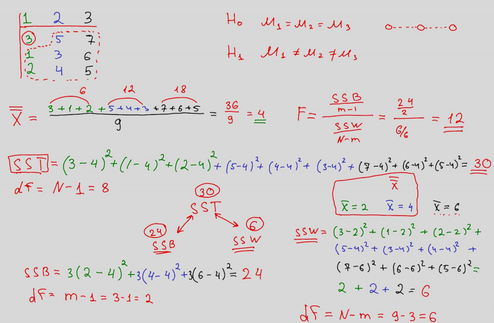
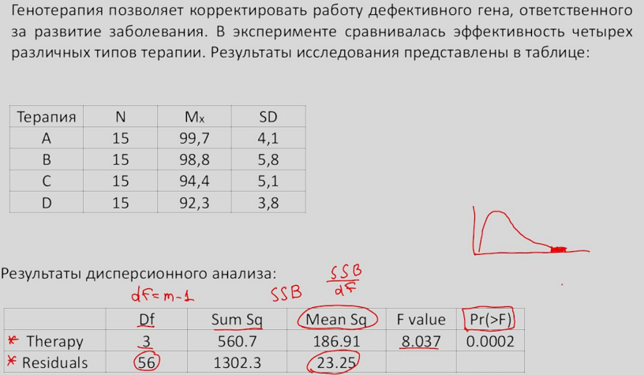
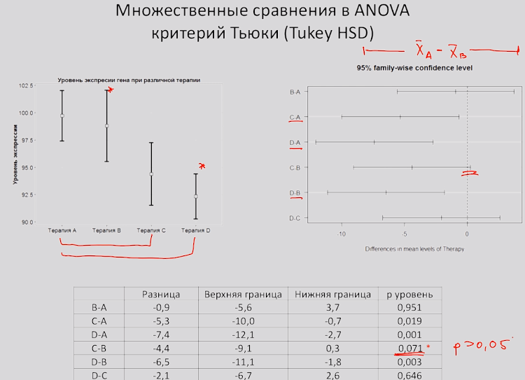
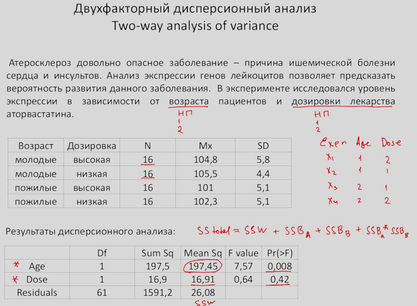
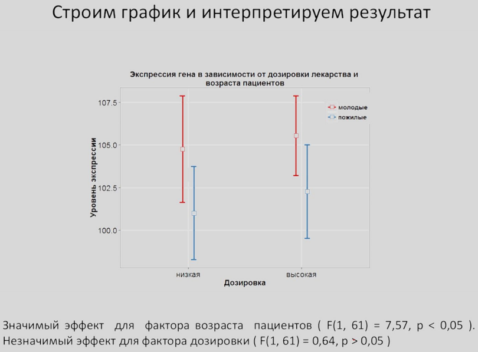
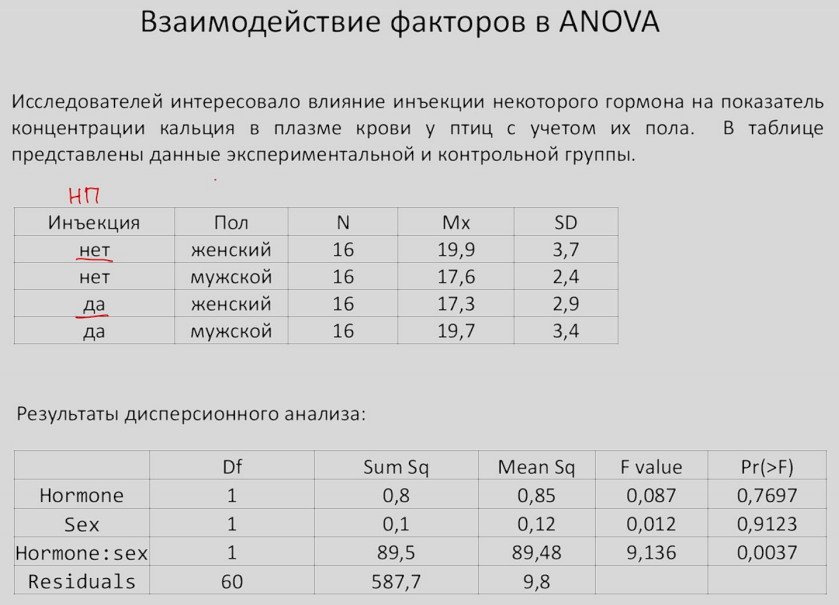

```{r setup, include=FALSE}
knitr::opts_chunk$set(echo = TRUE)
```

# Explain ANOVA

## Однофакторний дисперсійний аналіз. Коротка теорія  

1. Розраховується середнє значення серед усіх груп X.  
2. Розраховується SST = sum(xi-X)^2, число ступені свободи df = N -1, N – кіл-ть усіх елементів з усіх груп!  
3. Розраховується внутрішньогрупова сума квадратів SSW відхилень групових елементів від середнього кожної групи X1, X2, X3:  
SSW = (a1 - X1 )^2+(a2-X1)^2+(a3-X1)^2 + (a2-X2)^2+(a2-X2)^2 ...   
Число ступенів свободи для цього випадку обчислюється: df_w = N- m, m – кіль-ть груп.  
4. Розраховується міжгрупова сума квадратів SSB:   
SSB = (X1 - X)^2 + (X2 - X)^2 + (X3 - X)^2   
Число ступенів свободи df_b = m – 1, m – кіл-ть груп  
5. Розрахувати показник F-stat: F = SSB/(m-1) / SSW/(N-m)  
6. Застосувати один з крітеріїв попарного порівняння (Тьюкі, Бонфероні), аби дізнатися, які саме групи значимо відрізняються між собою.  
  
Теоретическое распределение F-значения в дисперсионном анализе не является нормальным, а подчиняется **распределению Фишера (F distribution)**. Вы можете посмотреть, как изменяется форма этого распределения в зависимости от числа степеней свободы (то есть от количества групп и общего числа наблюдений). Обратите внимание, что F-значение всегда является положительным, поэтому, в отличие от t-критерия, мы рассчитываем вероятность отклонения только в правую сторону.  
    
**Суть дисперсійного аналізу**. Ми кажемо, що вся варіабельність наших даних може бути обумовлена двома речами: варіабельність всередині груп та між групами. Якщо міжгруповий показник варіабельності SSB значно перевищує внутрішньогруповий SSW, то вельми ймовірно, що принаймні два середні значення значимо відрізняються між собою. Для того, щоб визначити наскільки ймовірна різниця, ми розраховуємо p-value за допомогою F-крітерія.  

  

**Важливе пояснення.** Якщо б три групи насправді мали однакові середні, тобто належали до однієї генеральної сукупності, то при великій кількості спроб виборок з ген. сукупності чисельник у формулі прямував би до нуля, а знаменник мав би певне значення. Це означає, що F мало б мати дуже невеликі значення.  
  
[**Розрахувати F-test**](https://gallery.shinyapps.io/dist_calc/)

**Множинні порівняння**. Якщо ми багатократно збільшуємо кількість груп, які ми будемо порівнювати між собою то ймовірність отримати хоча б одну значиму відмінність, якої взагалі не існує, дуже сильно збільшується. Щоби виправити цю ситуацію застосовують різні типи поправок.  
**Умови застосування дисперсійного аналізу:**  
1) нормальність розподілу залежної змінної в кожній з груп;  
2) приблизна рівність дисперсії в кожній з груп (гомогенність дисперсії). Перевіряється тестом Levene ( Levene’s test for homogeneity of Variance, p < 0.05);  
При наявності більш ніж 50 спостережень аналізуємих даних дисперсійний аналіз стає робастним по відношенню до цих припущень.  
  
## Однофакторний дисперсійний аналіз. Практика  

Read data:
```{r}
anova_df <- read.csv("genetherapy.csv")
anova_df
```
Compute the mean and standard deviation:
```{r}
anova_df %>% 
  group_by(Therapy) %>% 
  summarise(N = n(),
            Mx = mean(expr),
            SD = sd(expr)) -> df
df
```

Формулюємо нульову гіпотезу: середній рівень експресії генів буде однаковим для усіх чотирьох типів терапій:  
$$%mu _{1} = %mu _{2} = %mu _{3} = %mu _{4}$$  
Run the one-way ANOVA test with the command aov():
```{r}
res.aov <- aov(expr ~ Therapy, data = anova_df)
summary(res.aov)
```


**Важливо:** Рівень значущості Pr(>F) = 0.000152 каже нам про те, що отримати таке чи ще більше відхилення F = 8.037 можна з ймовірністю 0.000152. Це дає нам підстави відкинути нульову гіпотезу і зробити висновок: як мінімум 2 середні відрізняються між собою.
```{r}
ggplot(df, aes(x = Therapy, y = Mx, color = Therapy)) +
  geom_point(position = position_dodge(width = 0.25)) +
  geom_errorbar(aes(ymin = Mx - SD, ymax = Mx + SD), 
                position = position_dodge(width = 0.25),
                width = 0.2) +
  labs(title = "Експресія гена в залежності від терапії",
       y = "Рівень експрессії гена") +
  theme_classic()
```
**Інтерпретація результатів**: вдалося виявити статистично значимий взаємозв'язок типа терапії з показником рівня експресії гена (F(3,56) = 8.04, p < 0.05). 

Відхилення нульової гіпотези в дисперсійному аналізі дозволяє нам зробити поки що один висновок: як мінімум два середні відрізняються між собою. І нас цікавить між якою парою середніх є значима відмінність.  
  
**Крітерій Тьюкі (Tuckey HSD).** Крітерій розраховує довірчий інтервал для різниці між середніми значеннями і якщо такий інтервал не включає в себе нуль, то можна відхилити нульову гіпотезу про рівність середніх.  
```{r}
plot(TukeyHSD(res.aov, conf.level = 0.95))
```
**Результати аналізу:**  
На графіку ми бачимо, що група С відрізняється від А, група D від A і група D від B. Всі вони не включають нуль у довірчі інтервали і, отже, значимо відрізняються між собою.
```{r}
TukeyHSD(res.aov, conf.level = 0.95)
```


## Two-way analysis of variance (Двофакторний дисперсійний аналіз. Приклад)  
**Визначення.** Двофакторний дисперсійний аналіз досліджує вплив двох факторів (незалежних змінних) на залежну змінну.  
  
Load data
```{r}
anova2_df <- read.csv("atherosclerosis.csv")
anova2_df$age <- factor(anova2_df$age)
anova2_df
```
### Постановка експерименту  

### Compute the mean and standard deviation:
```{r}
anova2_df %>% 
  group_by(age, dose) %>% 
  summarise(N = n(),
            Mx = mean(expr),
            SD = sd(expr)) %>% ungroup() -> df2
#df2$age <- factor(df2$age) 
df2
```  
Try to change variables
```{r}
df2 %>% 
  mutate_at(c("age"), funs(ifelse(1, "молоді", .))) 
                                            
```
Побудуємо графік і проінтерпретуємо результат:
```{r}
ggplot(df2, aes(x = dose, y = Mx, color = age)) +
  geom_point(position = position_dodge(width = 0.25)) +
  geom_errorbar(aes(ymin = Mx - SD, ymax = Mx + SD), 
                position = position_dodge(width = 0.25),
                width = 0.2) +
  labs(title = "Експресія гена в залежності від рівня дозіроки ліків та віку пацієнтів",
       y = "Рівень експрессії гена") +
  theme_classic()
``` 
### Run the two-way ANOVA test with the command aov():
```{r}
res2.aov <- aov(expr ~ age + dose, data = anova2_df)
summary(res2.aov)
```
Основна ідея двохфакторного дисперсійного аналізу зводисть до того, що тепер у нас загальна мінливість SST буде мати чотири складові:  
$SST = SSW + SSB _{A} + SSB _{B} + SSB _{A}*SSB _{B}$  
Як ми бачимо з результатів, більша частина варіабельності в нас обумовлюється фактором віку (197.45).   
  
Отже, робимо висновок, що в результаті аналізу отримали:   
Значимий ефект для фактора віку пацієнтів (F(1, 61) = 7.57, p < 0.05)  
Незначиний ефект для фактора дозування (F(1, 61) = 0.64, p > 0.05)  

Застосуємо крітерій Тьюкі для визначення значимості відмінностей між групами факторів:
```{r}
TukeyHSD(res2.aov, conf.level = 0.95)
``` 
## Взємодія факторів у двофакторному дисперсійному аналізі (приклад).


  
Load data:
```{r}
anova2_fi <- read.csv("birds.csv")
str(anova2_fi)
```

```{r}
anova2_fi$sex <- factor(anova2_fi$sex)
anova2_fi$hormone <- factor(anova2_fi$hormone)
anova2_fi
```
Таблиця даних експериментальної контрольної групи:
```{r}
anova2_fi %>% 
  group_by(sex, hormone) %>% 
  summarise(N = n(),
            Mx = mean(var4),
            SD = sd(var4)) %>% ungroup() -> fi_table
fi_table$sex <- ifelse(fi_table$sex == '0', "M", "F")
fi_table$hormone <- ifelse(fi_table$hormone == '1', "no", "yes")
fi_table
```
### Run the two-way ANOVA test with the command aov():
```{r}
res3.aov <- aov(var4 ~ sex + hormone + sex*hormone, data = anova2_fi)
summary(res3.aov)
```
Ми бачимо, що ні фактор статі, ні фактор ін'єкції не вплинули значимо на нашу залежну змінну. А ось взаємодія факторів має зничимий вплив!  Побудуємо графік і проінтерпретуємо результат:
```{r}
ggplot(fi_table, aes(x = hormone, y = Mx, color = sex, group = sex)) +
  geom_point(position = position_dodge(width = 0.25)) +
  geom_line(position = position_dodge(width = 0.25)) +
  geom_errorbar(aes(ymin = Mx - SD, ymax = Mx + SD),
                position = position_dodge(width = 0.25),
                width = 0.2) +
  labs(title = "Дослідження концентрації кальція в плазмі крові птахів",
       y = "Концентрація 1мг/100мл", x = "Ін'єкція гормону") +
  theme_classic() +
  theme(plot.title = element_text(face = "bold", hjust = 0.5))
``` 
**Результат:**  
Незначимий ефект для фактора статі (F(1,60) = 0.012, p = 0.91 > 0.05)  
Незначимий ефект для фактора ін'єкції гормону (F(1,60) = 0.087, p = 0.77 > 0.05)
Значима взаємодія факторів (F(1,60) = 9.136, p = 0.0037 < 0.05 ).  
  
**Висновок**. Виявилося, шо сам факт ін'єкції по-різному вплинув на рівень концентрації в плазмі в залежності від статі. У випадку чоловічої статі (M) це призвело до збільшення показника і навпаки - призвело до зниження концентрації у випадку жіночої статі.


