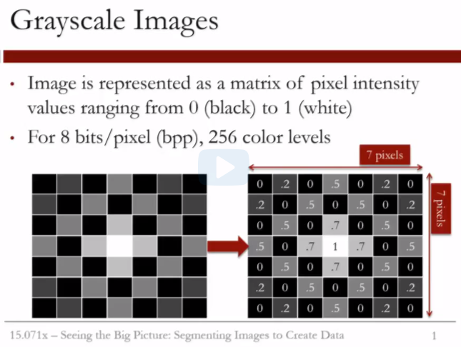
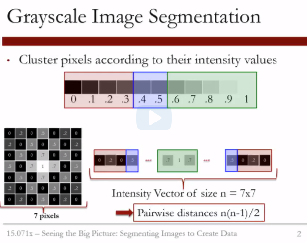
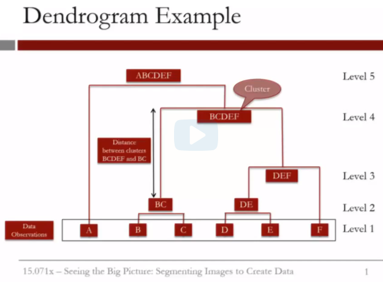
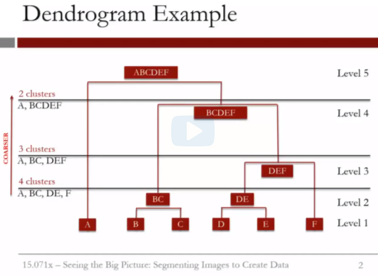

```{r setup, include=FALSE}
knitr::opts_chunk$set(echo = TRUE)

library(flexclust)
```



Let us try to understand the format of the data handed to us in the CSV files. Grayscale images are represented as a matrix of pixel intensity values that range from zero to one. The intensity value zero corresponds to the absence of color, or black, and the value one corresponds to white. For 8 bits per pixel images, we have 256 color levels ranging from zero to one. For instance, if we have the following grayscale image, the pixel information can be translated to a matrix of values between zero and one. It is exactly this matrix that we are given in our datasets. In other words, the datasets contain a table of values between zero and one. And the number of columns corresponds to the width of the image, whereas the number of rows corresponds to the height of the image. In this example, the resolution is 7 by 7 pixels. We have to be careful when reading the dataset in R. We need to make sure that R reads in the matrix appropriately. Until now in this class, our datasets were structured in a way where the rows refer to observations and the columns refer to variables. But this is not the case for the intensity matrix. So keep in mind that we need to do some maneuvering to make sure that R recognizes the data as a matrix.

  

Grayscale image segmentation can be done by clustering pixels according to their intensity values. So we can think of our clustering algorithm as trying to divide the spectrum of intensity values from zero to one into intervals, or clusters. For instance, the red cluster corresponds to the darkest shades, and the green cluster to the lightest. Now, what should the input be to the clustering algorithm? Well, our observations should be all of the 7
by 7 intensity values. Hence, we should have 49 observations. And we only have one variable, which is the pixel intensity value. So in other words, the input to the clustering algorithm should be a vector containing 49 elements, or intensity values. But what we have is a 7 by 7 matrix.  

A crucial step before feeding the intensity values to the clustering algorithm is morphing our data. We should modify the matrix structure and lump all the intensity values into a single vector. We will see that we can do this in R using the as.vector function. Now, once we have the vector, we can simply feed it into the clustering algorithm and assign each element in the vector to a cluster.  

Let us first use *hierarchical clustering* since we are familiar with it. The first step is to calculate the distance matrix, which computes the pairwise distances among the elements of the intensity vector. How many such distances do we need to calculate? Well, for each element in the intensity vector, we need to calculate its distance from the other 48 elements. So this makes 48 calculations per element. And we have 49 such elements in the intensity vector. In total, we should compute 49 times 48 pairwise distances. But due to symmetry, we really need to calculate half of them. So the number of pairwise distance calculations is actually (49*48)/2.  

In general, if we call the size of the intensity vector n, then we need to compute n*(n-1)/2 pairwise distances and store them in the distance matrix.  
Now we should be ready to go to R.  

Note that the default in R assumes that the first row in the dataset is the header. So if we didn't specify that we have no headers in this case, we would have lost the information from the first row of the pixel intensity matrix. Now let us look at the structure of the flower data frame. We realize that the way the data is stored does not reflect that this is a matrix of intensity values.
```{r}
flower <- read.csv("flower.csv", header = FALSE)
str(flower)
```

Let's try to change the data type to a matrix by using the as.matrix function. So let's define our variable flowerMatrix and then use the as.matrix function, which takes as an input the flower data frame.  
```{r}
flowerMatrix <- as.matrix(flower)
str(flowerMatrix)
```

And now if we look at the structure of the flower matrix, we realize that we have 50 rows and 50 columns. What this suggests is that the resolution of the image is 50 pixels in width and 50 pixels in height. This is actually a very, very small picture. I am very curious to see how this image looks like, but lets hold off now and do our clustering first. We do not want to be influenced by how the image looks like in our decision of the numbers of clusters we want to pick.  

To perform any type of clustering, we saw earlier that we would need to convert the matrix of pixel intensities to a vector that contains all the intensity values ranging from zero to one. And the clustering algorithm divides the intensity spectrum, the interval zero to one, into these joint clusters or intervals. So let us define the vector flowerVector, and then now we're going to use the function as.vector, which takes as an input the flowerMatrix.
```{r}
flowerVector <- as.vector(flowerMatrix)
str(flowerVector)
```

Now you might be wondering why we can't immediately convert the data frame flower to a vector. Let's try to do this.
```{r}
flowerVector2 <- as.vector(flower)
str(flowerVector2)
```

It seems that R reads it exactly like the flower data frame and sees it as 50 observations and 50 variables. So converting the data to a matrix and then to the vector is a crucial step.  
  
Now we should be ready to start our hierarchical clustering. The first step is to create the distance matrix, as you already know, which in this case computes the difference between every two intensity values in our flower vector.

```{r}
# Compute distances
distance <- dist(flowerVector, method = "euclidean")
```

# Video 3. Hierarchical clustering  

In our previous video, we found the distance matrix, which computes the pairwise distances between all the intensity values in the flower vector. Now we can cluster the intensity values using hierarchical clustering. So we're going to type clusterIntensity. And then we're going to use the hclust function, which is the hierarchical clustering function in R, which takes as an input the distance matrix.  

And then we're going to specify the clustering method to be "ward”. As a reminder, the Ward’s method is a minimum variance method, which tries to find compact and spherical clusters. We can think about it as trying to minimize the variance within each cluster and the distance among clusters.
```{r}
clusterIntensity <- hclust(distance, method="ward.D2")
```

Now we can plot the cluster dendrogram.
```{r}
plot(clusterIntensity)
```



And now we obtain the cluster dendrogram. Let's have here a little aside or a quick reminder about how to read a dendrogram and make sense of it. Let us first consider this toy dendrogram example. The lowest row of nodes represent the data or the individual observations, and the remaining nodes represent the clusters. The vertical lines depict the distance between two nodes or clusters. The taller the line, the more dissimilar the clusters are. For instance, cluster D-E-F is closer to cluster B-C-D-E-F than cluster B-C is. And this is well depicted by the height of the lines connecting each of clusters B-C and D-E-F to their parent node.  

  

Now cutting the dendrogram at a given level yields a certain partitioning of the data. For instance, if we cut the tree between levels two and three,
we obtain four clusters, A, B-C, D-E, and F. If we cut the dendrogram between levels three and four, then we obtain three clusters, A, B-C, and D-E-F.
And if we were to cut the dendrogram between levels four and five, then we obtain two clusters, A and B-C-D-E-F. What to choose, two, three, or four clusters? Well, the smaller the number of clusters, the coarser the clustering is. But at the same time, having many clusters may be too much of a stretch. We should always have this trade-off in mind.  
  
Now the distance information between clusters can guide our choice of the number of clusters. A good partition belongs to a cut that has a good enough room to move up and down. For instance, the cut between levels two and three can go up until it reaches cluster D-E-F. The cut between levels three and four has more room to move until it reaches the cluster B-C-D-E-F. And the cut between levels four and five has the least room. So it seems like choosing three clusters is reasonable in this case. Going back to our dendrogram, it seems that having two clusters or three clusters is reasonable in our case.  

```{r}
# Select 3 clusters
plot(clusterIntensity)
rect.hclust(clusterIntensity, k = 3, border = "red")
```

Now let us split the data into these three clusters. We're going to call our clusters, for instance, flowerClusters. And then we're going to use the function cutree. And literally, this function cuts the dendrogram into however many clusters we want. 
```{r}
flowerClusters <- cutree(clusterIntensity, k = 3)
flowerClusters
```

And we see that flowerClusters is actually a vector that assigns each intensity value in the flower vector to a cluster. It actually has the same length, which is 2,500, and has values 1, 2, and 3, which correspond to each cluster. To find the mean intensity value of each of our clusters, we can use the tapply function and ask R to group the values in the flower vector according to the flower clusters, and then apply the mean statistic to each of the groups.  
```{r}
# Find mean intensity values
tapply(flowerVector, flowerClusters, mean)
```

What we obtain is that the first cluster has a mean intensity value of 0.08, which is closest to zero, and this means that it corresponds to the darkest shape in our image. And then the third cluster here, which is closest to 1, corresponds to the fairest shade.  
  
And now the fun part. Let us see how the image was segmented. To output an image, we can use the image function in R, which takes a matrix as an input.
But the variable flowerClusters, as we just saw, is a vector. So we need to convert it into a matrix. We can do this by setting the dimension of this variable by using the dimension function.  

So, let's use the dimension function, or dim, which takes as input flowerClusters. And then we're going to use the combined function, or the c function. And its first argument will be the number of rows that we want for the matrix, and that would be 50. And the second argument would be the number of columns. Why did we use 50? Simply because we have a 50 by 50 resolution picture.  
```{r}
# Plot the image and the clusters
dim(flowerClusters) = c(50,50)
```

Now we can use the function image, which takes as an input the flowerClusters matrix. And let's turn off the axes by writing axes=FALSE.  
```{r}
image(flowerClusters, axes = FALSE)
```

And now, going back to our graphics window, we can see our segmented image here. The darkest shade corresponds to the background, and this is actually associated with the first cluster. The one in the middle is the core of the flower, and this is cluster 2. And then the petals correspond to cluster 3,
which has the fairest shade in our image.  
  
Let us now check how the original image looked. Let's go back to the console and then maximize it here. So let's go back to our image function, but now this time the input is the flower matrix. And then let's keep the axis as false. But now, how about we add an additional argument regarding the color scheme? Let's make it grayscale. So we're going to take the color, and it's going to take the function gray. And the input to this function is a sequence of values that goes from 0 to 1, which actually is from black to white. And then we have to also specify its length, and that's specified as 256, because this corresponds to the convention for grayscale.
```{r}
# Original image
image(flowerMatrix,axes=FALSE,col=grey(seq(0,1,length=256)))
```

And now, going back to our image, now we can see our original grayscale image here. You can see that it has a very, very low resolution. But in our next video, we will try to segment an MRI image of the brain that has a much, much higher resolution.  
  
## Caution on Video 4: MRI Image 

The following video on MRI image asks you to run the "dist" function on a large vector, in order to demonstrate an error related to memory. Some students have found that running this function causes computer memory errors on their personal computers that can take up to an hour to resolve.

We suggest that you not run the "dist" function the first time it comes up in the video if you are following along in R. We apologize for the inconvenience.

# Video 4

In this video we will try to segment an MRI brain image of a healthy patient using hierarchical clustering. Make sure that you are in the directory where you saved the healthy.csv file. We will be following the exact same steps we did in the previous video.  

First, read in the data, and call the data frame healthy. Use the read.csv function to read in the healthy data set. And remember that this healthy data set consists of a matrix of intensity values, so let's set the header to false. And now let's create the healthy matrix using the as.matrix function, which takes as an input the healthy data frame.  

```{r}
healthy <- read.csv("healthy.csv", header = FALSE)
healthyMatrix <- as.matrix(healthy)
str(healthyMatrix)
```

And now let's output the structure of the healthy matrix. And then we realize that we have 566 by 646 pixel resolution for our image. So this MRI image is considerably larger than the little flower image that we saw, and we worked with in the previous two videos. To see the MRI image, we can use the image function in R, which takes as an input the healthy matrix. And then let's turn our axes off. And then use the grey-scale color scheme.  

```{r}
image(healthyMatrix, axes = FALSE, col = grey(seq(0, 1, length = 256)))
```

So the color is equal to grey, which shades a sequence of values going from zero to one, with the length of 256. And now going to our graphics window, we see that what we have is the T2-weighted MRI imaging of a top section of the brain. And it shows different substances, such as the gray matter, the white matter, and the cerebrospinal fluid.  
  
Now let us see if we can isolate these substances via hierarchical clustering. We first need to convert the healthy matrix to a vector, and let's call it healthyVector.
```{r}
healthyVector <- as.vector(healthyMatrix)
#distance = dist(healthyVector, method = "euclidean")
```

Oh, R gives us an error that seems to tell us that our vector is huge, and R cannot allocate enough memory. Well let us see how big is our vector. So we're going to go and use the structure function over the healthy vector, and let's see what we obtain. Hm. 
```{r}
str(healthyVector)
```

The healthy vector has 365,636 elements. Let's call this number n. And remember, from our previous video, that for R to calculate the pairwise distances, it would actually need to calculate n*(n-1)/2 and then store them in the distance matrix. Let's see how big this number is.  
```{r}
length(healthyVector) * (length(healthyVector) - 1) / 2
```

Wow. Of course R would complain. It's 67 billion values that we're asking R to store in a matrix. The bad news now is that we cannot use hierarchical clustering.  
  
Is there any other solution? Well, we have seen in lecture two that another clustering method is k-means. Let us review it first, and see if it could work on our high resolution image.  

# Video 6. K-means  

The first step in k-means clustering involves specifying the number of clusters, k. But how do we select k? Well, our clusters would ideally assign each point in the image to a tissue class or a particular substance, for instance, grey matter or white matter, and so on. And these substances are known to the medical community. So setting the number of clusters depends on exactly what you're trying to extract from the image. For the sake of our example, let's set the number of clusters here, k, to five.  
```{r}
# Specify number of clusters
k <- 5
```

And since the k-means clustering algorithm starts by randomly assigning points to clusters, we should set the seed, so that we all obtain the same clusters. So let's type set.seed, and give it a value of 1. To run the k-means clustering algorithm, or KMC in short, we need to use the kmeans function in R. And the first input is whatever we are trying to cluster. In this case it is the healthy vector. The second argument is the number of clusters, and we can specify it using the argument centers, and that would be equal to k. And then finally, since the k-means is an iterative method that could take very long to converge, we need to set a maximum number of iterations.  
```{r}
set.seed(1)
KMC <- kmeans(healthyVector, centers = k, iter.max = 1000)
str(KMC)
```

Now to see the result of the k-means clustering algorithm, we can output the structure of the KMC variable. The first, and most important, piece of information that we get, is the cluster vector. Which assigns each intensity value in the healthy vector to a cluster. In this case, it will be giving them values 1 through 5, since we have 5 clusters. Now recall that to output the segmented image, we need to extract this vector. The way to do this is by using the dollar notation. For instance, let us define healthyClusters, and then set it equal to KMC$cluster.
  
And what we're basically doing here is that we are taking the information, extracting the information of the cluster vector, and putting it in the new variable that is called healthyClusters.  
```{r}
# Extract clusters
healthyClusters <- KMC$cluster
```

Now how can we obtain the mean intensity value within each of our 5 clusters? In hierarchical clustering, we needed to do some manual work,
and use the tapply function to extract this information. In this case, we have the answers ready, under the vector centers. In fact, for instance, the mean intensity value of the first cluster is 0.48, and the mean intensity value of the last cluster is 0.18. We can also extract this information using the dollar sign.
```{r}
KMC$centers[2]
```

Before we move on, I would like to point your attention to one last interesting piece of information that we can get here. And that is the size of the cluster. For instance, the largest cluster that we have is the third one, which combines 133,000 values in it. And interestingly, it's the one that has the smallest mean intensity value, which means that it corresponds to the darkest shade in our image. Actually, if we look at all the mean intensity values, we can see that they are all less than 0.5. So they're all pretty close to 0. And this means that our images is pretty dark. If we look at our image again, it's indeed very dark. And we have very few points that are actually white.  
  
Let us output the segmented image and see what we get. Recall that we first need to convert the vector healthy clusters to a matrix. To do this, we will use the dimension function, that takes as an input the healthyClusters vector.
```{r}
dim(healthyClusters) <- c(nrow(healthyMatrix), ncol(healthyMatrix))
```

And now we can visualize our clusters by using the function image, which takes as an input the healthyClusters matrix. And let's turn off the axes. And then let's be creative and use a fancy color scheme. We're going to invoke for color here, the rainbow palette in R. And the rainbow palette, or the function rainbow, takes as an input the number of colors that we want. In this case, the number of colors would correspond to the number of clusters. So the input would be k.  
```{r}
image(healthyClusters, axes = FALSE, col = rainbow(k))
```

And now let's output the segmented image. Going back to the graphics window, we see that k-means algorithm was able to segment the image in 5 different clusters. More refinement maybe needs to be made to our clustering algorithm to appropriately capture all the anatomical structures.
But this seems like a good starting point. The question now is, can we use the clusters, or the classes, found by our k-means algorithm on the healthy MRI image to identify tumors in another MRI image of a sick patient?  

## SCREE PLOTS  

While dendrograms can be used to select the final number of clusters for Hierarchical Clustering, we can't use dendrograms for k-means clustering. However, there are several other ways that the number of clusters can be selected. One common way to select the number of clusters is by using a scree plot, which works for any clustering algorithm.  

A standard scree plot has the number of clusters on the x-axis, and the sum of the within-cluster sum of squares on the y-axis. The within-cluster sum of squares for a cluster is the sum, across all points in the cluster, of the squared distance between each point and the centroid of the cluster.  We ideally want very small within-cluster sum of squares, since this means that the points are all very close to their centroid.  
  
To create the scree plot, the clustering algorithm is run with a range of values for the number of clusters. For each number of clusters, the within-cluster sum of squares can easily be extracted when using k-means clustering. For example, suppose that we want to cluster the MRI image from this video into two clusters. We can first run the k-means algorithm with two clusters:
```{r}
KMC2 <- kmeans(healthyVector, centers = 2, iter.max = 1000)
KMC3 <- kmeans(healthyVector, centers = 3, iter.max = 1000)
KMC4 <- kmeans(healthyVector, centers = 4, iter.max = 1000)
KMC5 <- kmeans(healthyVector, centers = 5, iter.max = 1000)
KMC6 <- kmeans(healthyVector, centers = 6, iter.max = 1000)
KMC7 <- kmeans(healthyVector, centers = 7, iter.max = 1000)
KMC8 <- kmeans(healthyVector, centers = 8, iter.max = 1000)
KMC9 <- kmeans(healthyVector, centers = 9, iter.max = 1000)
KMC10 <- kmeans(healthyVector, centers = 10, iter.max = 1000)
```

Then, the within-cluster sum of squares is just an element of KMC2:
```{r}
KMC2$withinss
```

This gives a vector of the within-cluster sum of squares for each cluster (in this case, there should be two numbers).  
  
Now suppose we want to determine the best number of clusters for this dataset. We would first repeat the kmeans function call above with centers = 3, centers = 4, etc. to create KMC3, KMC4, and so on. Then, we could generate the following plot:
```{r}
NumClusters <- seq(2, 10, 1)
SumWithinss <- c(sum(KMC2$withinss), sum(KMC3$withinss), sum(KMC4$withinss), sum(KMC5$withinss), sum(KMC6$withinss), sum(KMC7$withinss), sum(KMC8$withinss), sum(KMC9$withinss), sum(KMC10$withinss))
```

The plot looks like this (the type="b" argument just told the plot command to give us points and lines):
```{r}
plot(NumClusters, SumWithinss, type = "b")
```

To determine the best number of clusters using this plot, we want to look for a bend, or elbow, in the plot. This means that we want to find the number of clusters for which increasing the number of clusters further does not significantly help to reduce the within-cluster sum of squares. For this particular dataset, it looks like 4 or 5 clusters is a good choice. Beyond 5, increasing the number of clusters does not really reduce the within-cluster sum of squares too much.  
  
*Note:* You may have noticed it took a lot of typing to generate SumWithinss; this is because we limited ourselves to R functions we've learned so far in the course. In fact, R has powerful functions for repeating tasks with a different input (in this case running kmeans with different cluster sizes). For instance, we could generate SumWithinss with: 
```SumWithinss = sapply(2:10, function(x) sum(kmeans(healthyVector, centers=x, iter.max=1000)$withinss))```   
  
We won't be teaching more advanced R functions like sapply in this course, but if you're interested you could read more here.

# Video 6. Detecting Tumors  
  
In the previous video we identified clusters, or tissue substances, in a healthy brain image. It would be really helpful if we can use these clusters to automatically detect tumors in MRI images of sick patients. The tumor.csv file corresponds to an MRI brain image of a patient with oligodendroglioma, a tumor that commonly occurs in the front lobe of the brain. Since brain biopsy is the only definite diagnosis of this tumor, MRI guidance is key in determining its location and geometry.  
```{r}
tumor <- read.csv("tumor.csv", header = FALSE)
tumorMatrix <- as.matrix(tumor)
tumorVector <- as.vector(tumorMatrix)
```

Now, we will not run the k-means algorithm again on the tumor vector. Instead, we will apply the k-means clustering results that we found using the healthy brain image on the tumor vector. In other words, we treat the healthy vector as training set and the tumor vector as a testing set. To do this, we first need to install a new package that is called flexclust.  
  
The flexclust package contains the object class KCCA, which stands for K-Centroids Cluster Analysis. We need to convert the information from the clustering algorithm to an object of the class KCCA. And this conversion is needed before we can use the predict function on the test set tumorVector.  

So calling our new variable KMC.kcca and then using the as.kcca function, which takes as a first input the original KMC variable that stored all the information from the k-means clustering function, and the second input is the data that we clustered. And in this case, it's the training set, which is the healthyVector.
```{r}
KMC.kcca <- as.kcca(KMC, healthyVector)
```

Now that R finally finished creating the object KMC.kcca, we can cluster the pixels in the tumorVector using the predict function.
```{r}
tumorClusters <- predict(KMC.kcca, newdata = tumorVector)
```

And now, the tumorClusters is a vector that assigns a value 1 through 5 to each of the intensity values in the tumorVector, as predicted by the k-means algorithm.

```{r}
# Visualize the clusters
dim(tumorClusters) = c(nrow(tumorMatrix), ncol(tumorMatrix))
image(tumorClusters, axes = FALSE, col=rainbow(k))
```

Let's navigate to the graphics window, now, to see if we can detect the tumor. Oh, and yes, we do! It is this abnormal substance here that is highlighted in blue that was not present in the healthy MRI image. So we were successfully able to identify, more or less, the geometry of the malignant structure. We see that we did a good job capturing the major tissue substances of the brain. The grey matter is highlighted in purple and the white matter in yellow. For the sick patient, the substance highlighted in blue is the oligodendroglioma tumor. Notice that we do not see substantial blue regions in the healthy brain image, apart from the region around the eyes. Actually, looking at the eyes regions,
we notice that the two images were not taken precisely at the same section of the brain. This might explain some differences in shapes between the two images. Let's see how the images look like originally. We see that the tumor region has a lighter color intensity, which is very similar to the region around the eyes in the healthy brain image. This might explain highlighting this region in blue. Of course, we cannot claim that we did a wonderful job obtaining the exact geometries of all the tissue substances, but we are definitely on the right track.  

In fact, to do so, we need to use more advanced algorithms and fine-tune our clustering technique. MRI image segmentation is an ongoing field of research. While k-means clustering is a good starting point, more advanced techniques have been proposed in the literature, such as the *modified fuzzy k-means clustering method*. Also, if you are interested, R has packages that are specialized for analyzing medical images.  
  
