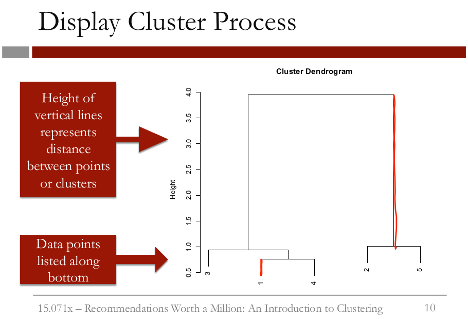
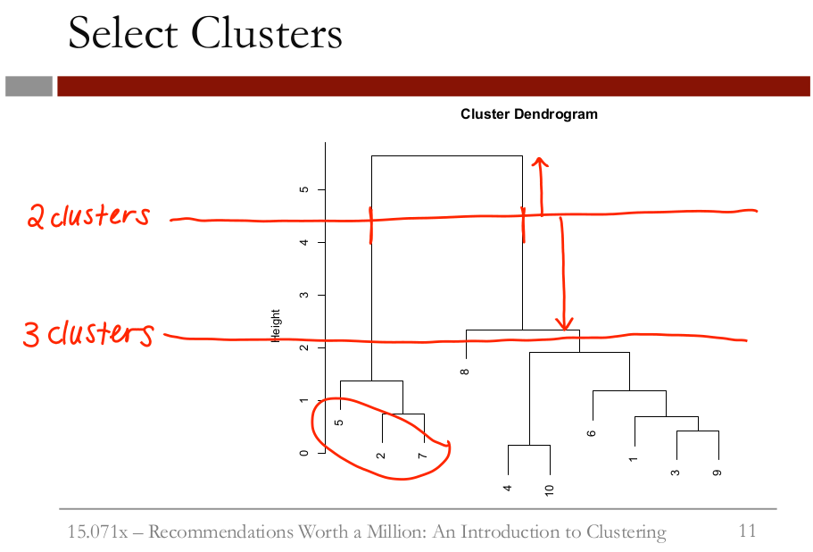

```{r setup, include=FALSE}
knitr::opts_chunk$set(echo = TRUE)

library(dplyr)
library(magrittr)
```

# Hierarchical Clusters  


The hierarchical cluster process can be displayed through what's called a dendrogram. The data points are listed along the bottom, and the lines show how the clusters were combined. The height of the lines represents how far apart the clusters were when they were combined. So points 1 and 4 were pretty close together when they were combined. But when we combined the two clusters at the end, they were significantly farther apart. We can use a dendrogram to decide how many clusters we want for our final clustering model. This dendrogram shows the clustering process with ten data points. The easiest way to pick the number of clusters you want is to draw a horizontal line across the dendrogram. The number of vertical lines that line crosses is the number of clusters there will be. In this case, our line crosses two vertical lines, meaning that we will have two clusters-- one cluster with points 5, 2, and 7, and one cluster with the remaining points.  


The farthest this horizontal line can move up and down in the dendrogram without hitting one of the horizontal lines of the dendrogram, the better that choice of the number of clusters is. If we instead selected three clusters, this line can't move as far up and down
without hitting horizontal lines in the dendrogram. This probably means that the two cluster choice is better. But when picking the number of clusters, you should also consider how many clusters make sense for the particular application you're working with. After selecting the number of clusters you want, you should analyze your clusters to see if they're meaningful. This can be done by looking at basic statistics in each cluster, like the mean, maximum, and minimum values in each cluster and each variable. You can also check to see if the clusters have a feature in common that was not used in the clustering, like an outcome variable. This often indicates that your clusters
might help improve a predictive model. In the next video, we'll cluster our movies by genre, and then analyze our clusters to see how they can be used to perform content filtering.  

# Netflix data  

In this video, we'll be downloading our dataset from the MovieLens website. Please open the following link in a new window or tab of your browser to access the data:

### After following the steps in the video, load the data into R
```{r}
movies <- read.table(url("http://files.grouplens.org/datasets/movielens/ml-100k/u.item"), header = FALSE, sep = "|",quote = "\"")
```

Let's take a look at the structure of our data using the str function.  
```{r}
str(movies)
```

### Add column names
```{r}
colnames(movies) <- c("ID", "Title", "ReleaseDate", "VideoReleaseDate", "IMDB", "Unknown", "Action", "Adventure", "Animation", "Childrens", "Comedy", "Crime", "Documentary", "Drama", "Fantasy", "FilmNoir", "Horror", "Musical", "Mystery", "Romance", "SciFi", "Thriller", "War", "Western")
str(movies)
```

### Remove unnecessary variables

```{r}
movies$ID <- NULL
movies$ReleaseDate <- NULL
movies$VideoReleaseDate <- NULL
movies$IMDB <- NULL
```

### Remove duplicates

```{r}
movies <- unique(movies)
```

### Take a look at our data again:

```{r}
str(movies)
```

## QQ

Using the table function in R, please answer the following questions about the dataset "movies".  

*Q: How many movies are classified as comedies?*  
```{r}
table(movies$Comedy)
```

*Q: How many movies are classified as westerns?*
```{r}
table(movies$Western)
```

*Q: How many movies are classified as romance AND drama?*  
```{r}
table(movies$Drama, movies$Romance)
```

In this video we'll use hierarchical clustering to cluster the movies in the Movie Lens data set by genre. After we make our clusters, we'll see how they can be used to make recommendations. There are two steps to hierarchical clustering. First we have to compute the distances between all data points, and then we need to cluster the points. To compute the distances we can use the dist function. We only want to cluster our movies on the genre variable, not on the title variable, so we'll cluster on columns two through 20.  
```{r}
# Compute distances
distances <- dist(movies[2:20], method = "euclidean")
```

Now let's cluster our movies using the hclust function for hierarchical clustering.  

The ward method cares about the distance between clusters using centroid distance, and also the variance in each of the clusters.
```{r}
# Hierarchical clustering
clusterMovies <- hclust(distances, method = "ward.D2") 
```

Now let's plot the dendrogram of our clustering algorithm by typing plot, and then in parentheses clusterMovies.
```{r}
plot(clusterMovies)
```

This dendrogram might look a little strange. We have all this black along the bottom. Remember that the dendrogram lists all of the data points along the bottom. But when there are over 1,000 data points it's impossible to read. We'll see later how to assign our clusters to groups so that we can analyze which data points are in which cluster. So looking at this dendrogram, how many clusters would you pick?
It looks like maybe three or four clusters would be a good choice according to the dendrogram, but let's keep our application in mind, too. We probably want more than two, three, or even four clusters of movies to make recommendations to users. It looks like there's a nice spot down here where there's 10 clusters. This is probably better for our application. We could select even more clusters if we want to have very specific genre groups. If you want a lot of clusters it's hard to pick the right number from the dendrogram. You need to use your understanding of the problem to pick the number of clusters. Let's stick with 10 clusters for now, combining what we learned from the dendrogram with our understanding of the problem.  
  
Now we can label each of the data points according to what cluster it belongs to using the cutree function.
```{r}
clusterGroups <- cutree(clusterMovies, k = 10)
```

Now let's figure out what the clusters are like. We'll use the tapply function to compute the percentage of movies in each genre and cluster.  
```{r}
# Let's use the tapply function to compute the percentage of movies in each genre and cluster
tapply(movies$Action, clusterGroups, mean)
```

So what does this do? It divides our data points into the 10 clusters and then computes the average value of the action variable for each cluster. Remember that the action variable is a binary variable with value 0 or 1. So by computing the average of this variable we're computing the percentage of movies in that cluster that belong in that genre. So we can see here that in cluster 2, about 78% of the movies have the action genre label, whereas in cluster 4 none of the movies are labeled as action movies.  

Let's try this again, but this time let's look at the romance genre. 
```{r}
tapply(movies$Romance, clusterGroups, mean)
```

We can repeat this for each genre. If you do, you get the results in ClusterMeans.ods.  
Here we have in each column the cluster, and in each row the genre. I highlighted the cells that have a higher than average value. So we can see here in cluster 2, as we saw before, that cluster 2 has a high number of action movies. Cluster 1 has a little bit of everything, some animation, children's, fantasy, musicals, war and westerns. So I'm calling this the miscellaneous cluster. Cluster 2 has a lot of the action, adventure, and sci-fi movies. Cluster 3 has the crime, mystery, thriller movies. Cluster 4 exclusively has drama movies.
Cluster 5, exclusively has comedies.  
Cluster 6 has a lot of the romance movies.  
Cluster 7 has movies that are comedies and romance movies, so I'm calling these the romantic comedies.  
Cluster 8 has the documentaries.  
Cluster 9 has the movies that are comedies and dramas, so the dramatic comedies.  
And cluster 10 has the horror flicks.  
Knowing common movie genres, these clusters seem to make a lot of sense. So now, back in our R console, let's see how these clusters could be used in a recommendation system.

Find which cluster Men in Black is in.
```{r}
subset(movies, Title == "Men in Black (1997)")
```

So which cluster did the 257th movie go into? We can figure this out by typing clusterGroups[257].
```{r}
clusterGroups[257]
```

So let's create a new data set with just the movies from cluster two. We'll call it cluster2, and use the subset function to take a subset of movies only taking the observations for which clusterGroups is equal to 2.
```{r}
cluster2 <- subset(movies, clusterGroups == 2)
```

Look at the first 10 titles in this cluster:
```{r}
cluster2$Title[1:10]
```

So it looks like good movies to recommend to Amy, according to our clustering algorithm, would be movies like Apollo 13 and Jurassic Park. In this video we saw how clustering can be applied to create a movie recommendation system.  

# QQ

Run the cutree function again to create the cluster groups, but this time pick k = 2 clusters. It turns out that the algorithm groups all of the movies that only belong to one specific genre in one cluster (cluster 2), and puts all of the other movies in the other cluster (cluster 1). What is the genre that all of the movies in cluster 2 belong to?  
```{r}
QQ2 <- cutree(clusterMovies, k = 2)
cl2 <- subset(movies, QQ2 == 2)
cl2[1:10,]
```

```{r}
movies %>% 
  mutate(cluster = QQ2) %>% 
  select(-Title) %>% 
  count()
```

```{r}
tapply(movies$Romance, QQ2, mean)
```

```{r}
tapply(movies$Drama, QQ2, mean)
```

# An Advanced Approach to Finding Cluster Centroids  

In this video, we explain how you can find the cluster centroids by using the function "tapply" for each variable in the dataset. While this approach works and is familiar to us, it can be a little tedious when there are a lot of variables. An alternative approach is to use the colMeans function. With this approach, you only have one command for each cluster instead of one command for each variable. If you run the following command in your R console, you can get all of the column (variable) means for cluster 1:  

```{r}
colMeans(subset(movies[2:20], clusterGroups == 1))  
```

You can repeat this for each cluster by changing the clusterGroups number. However, if you also have a lot of clusters, this approach is not that much more efficient than just using the tapply function.   
  
A more advanced approach uses the "split" and "lapply" functions. The following command will split the data into subsets based on the clusters:  
```{r}
spl = split(movies[2:20], clusterGroups)
```

Then you can use spl to access the different clusters, because spl[[1]] is the same as
```subset(movies[2:20], clusterGroups == 1)```  

so colMeans(spl[[1]]) will output the centroid of cluster 1. But an even easier approach uses the lapply function. The following command will output the cluster centroids for all clusters:  
```{r}
lapply(spl, colMeans)
```

The lapply function runs the second argument (colMeans) on each element of the first argument (each cluster subset in spl). So instead of using 19 tapply commands, or 10 colMeans commands, we can output our centroids with just two commands: one to define spl, and then the lapply command.  
  
Note that if you have a variable called "split" in your current R session, you will need to remove it with rm(split) so that you can use the split function.  

