```{r setup, include=FALSE}
knitr::opts_chunk$set(echo = TRUE)
```

Make bookdown!!!

## **The linear regression**
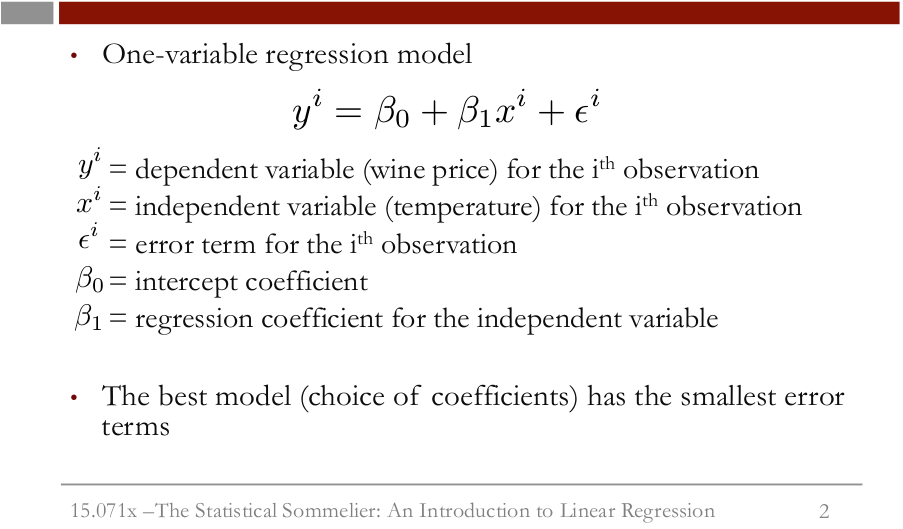

## **Selecting the best model**

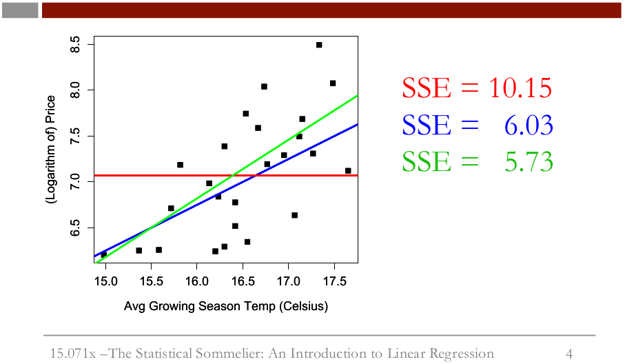

## **Linear regression explanation**

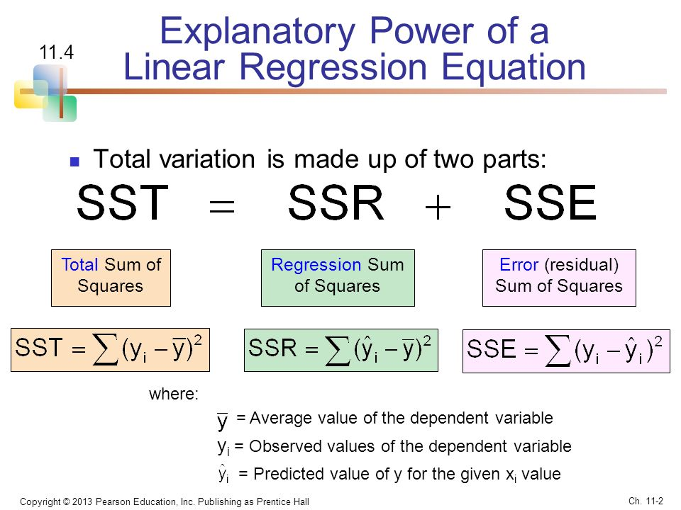
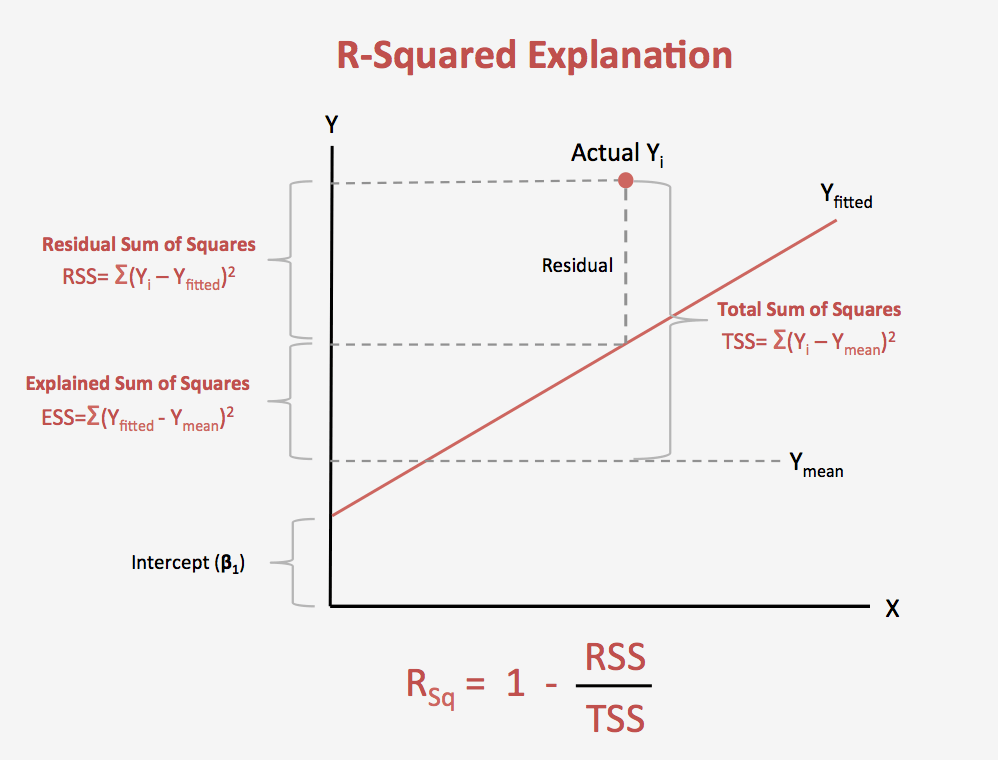

## **Other error measures**

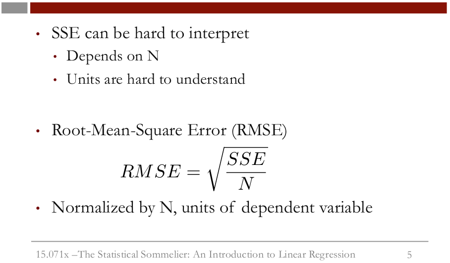

## **$R^2$**

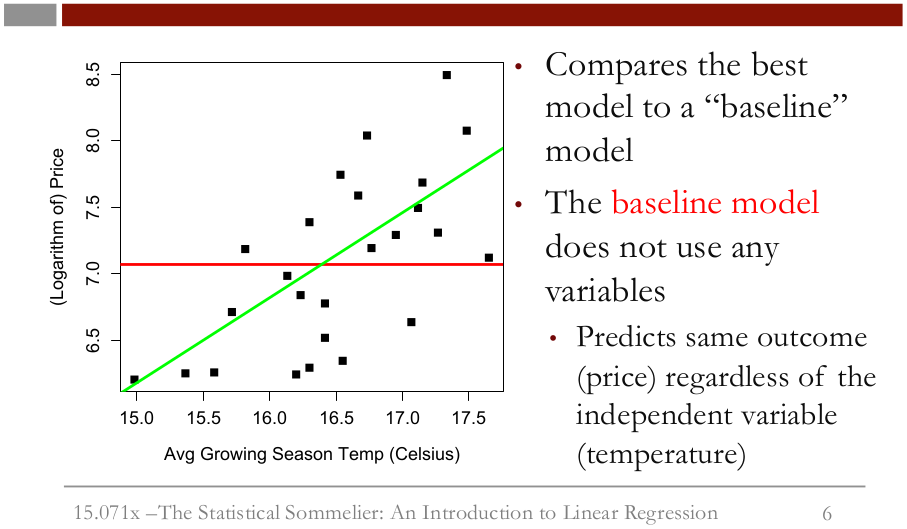

## **Interpreting $R^2$**

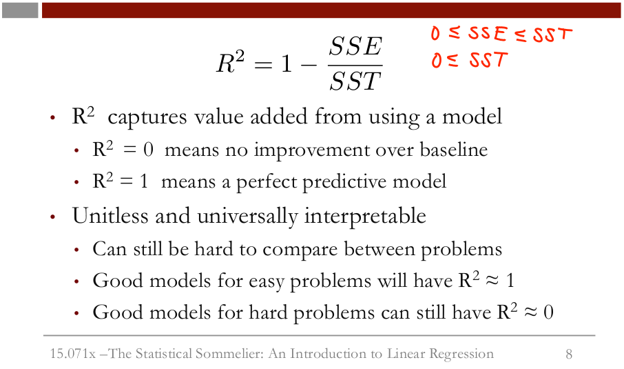

## **Multiple Linear Regression**

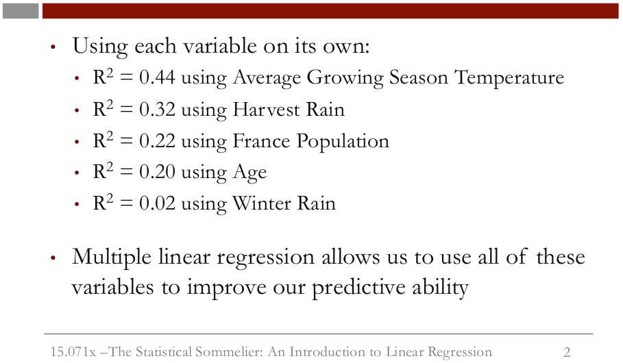

## **Multiple Regression Model**

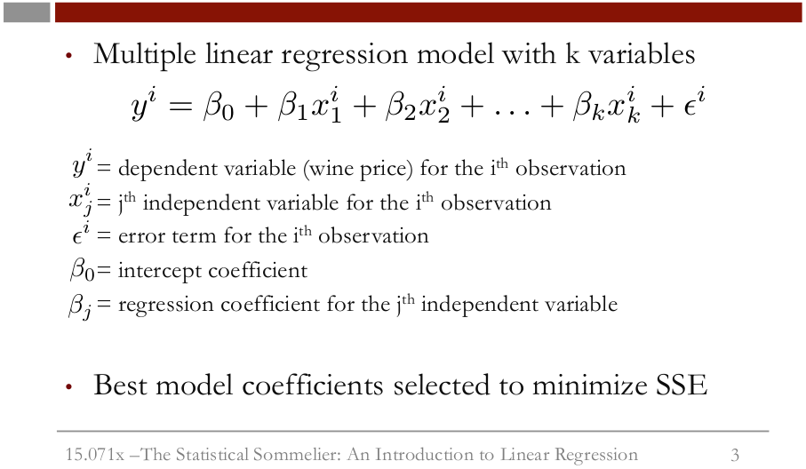

## **Adding variables**

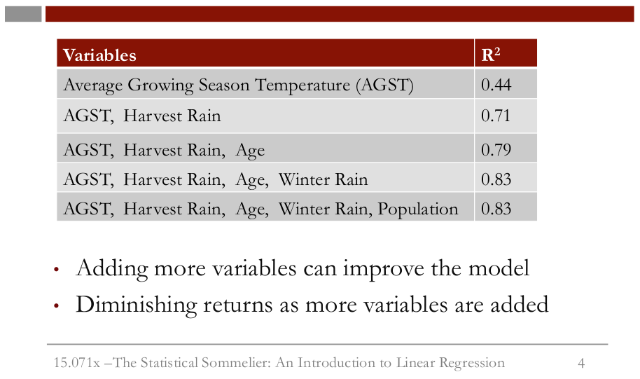
The marginal improvement from adding an additional variable decreases as we add more and more variables.

## **Selection variables**

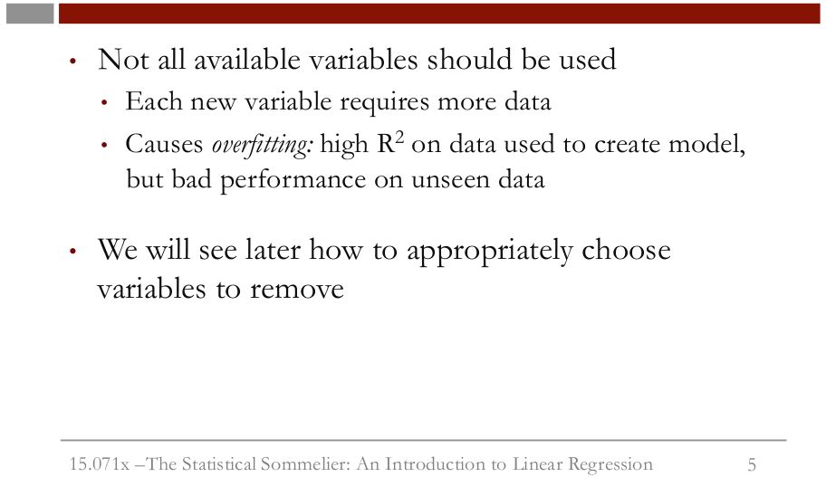  

## **Multiple and Adjusted R-squared**

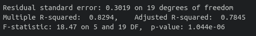
  
**Adjusted R-squared:** this number adjusts the R-squared value to account for the number of independent variables used relative to the number of data points. Multiple R-squared will always increase if you add more independent variables. But Adjusted R-squared will decrease if you add an independent variable that doesn't help the model.  

**Скоректований R2 (Adjusted R-squared)** налаштовує значення R-квадрата для обліку кількості незалежних змінних, що використовуються відносно кількості точок даних. Множинний R2 завжди зростатиме, якщо додати більше незалежних змінних. Але скоректований R-квадрат зменшиться, якщо ви додасте незалежну змінну, яка не допомагає моделі.  

## **Understanding Model and Coefficients**

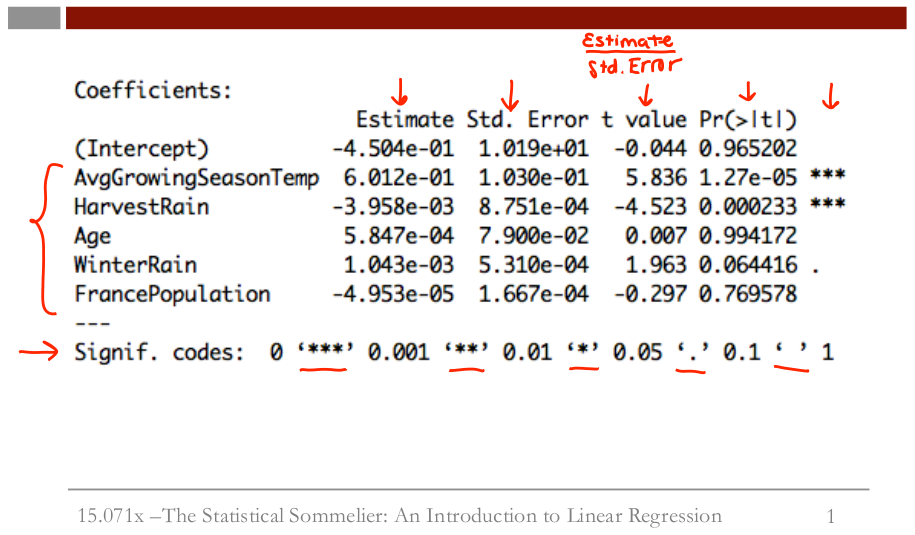

The output of the Coefficients section of the summary function is shown here. The independent variables are listed on the left. The **Estimate** column gives the coefficients for the intercept and for each of the independent variables in our model.  

The remaining columns help us to determine if a variable should be included in the model, or if its coefficient is significantly different from 0. A coefficient of 0 means that the value of the independent variable does not change our prediction for the dependent variable. If a coefficient is not significantly different from 0, then we should probably remove the variable from our model since it's not helping to predict the dependent variable.   
The **standard error** column gives a measure of how much the coefficient is likely to vary from the estimate value.   

The **t value** is the estimate divided by the standard error. It will be negative if the estimate is negative and positive if the estimate is positive. The larger the absolute value of the t value, the more likely the coefficient is to be significant. So we want independent variables with a large absolute value in this column.  

The **last column** of numbers gives a measure of how plausible it is that the coefficient is actually 0, given the data we used to build the model. The less plausible it is, or the smaller the probability number in this column, the less likely it is that our coefficient estimate is actually 0. This number will be large if the absolute value of the t value is small, and it will be small if the absolute value of the t value is large. We want independent variables with small values in this column.   

The easiest way in R to determine if a variable is significant is to look at the **stars** at the end of each row. The star coding scheme is explained
at the bottom of the Coefficients table. Three stars is the highest level of significance and corresponds to a probability value less than 0.001, or the smallest possible probabilities. Two stars is also very significant and corresponds to a probability between 0.001 and 0.01. One star is still significant and corresponds to a probability between 0.01 and 0.05. A period, or dot, means that the coefficient is almost significant and corresponds to a probability between 0.05 and 0.10.

## **Corellation and Multicollinearity**
   
[Мультиколлинеарность (multicollinearity)](https://ru.wikipedia.org/wiki/%D0%9C%D1%83%D0%BB%D1%8C%D1%82%D0%B8%D0%BA%D0%BE%D0%BB%D0%BB%D0%B8%D0%BD%D0%B5%D0%B0%D1%80%D0%BD%D0%BE%D1%81%D1%82%D1%8C) — в эконометрике (регрессионный анализ) — наличие линейной зависимости между объясняющими переменными (факторами) регрессионной модели. При этом различают полную коллинеарность, которая означает наличие функциональной (тождественной) линейной зависимости и частичную или просто мультиколлинеарность — наличие сильной корреляции между факторами.  
  
Косвенными признаками мультиколлинеарности являются высокие стандартные ошибки **standard errors** оценок параметров модели, малые t-статистики **t-statistic** (то есть незначимость коэффициентов), неправильные знаки оценок, при том, что модель в целом признается статистически значимой (большое значение F-статистики). О мультиколлинеарности также может свидетельствовать сильное изменение оценок параметров от добавления (или удаления) выборочных данных (если соблюдены требования достаточной однородности выборки).   
  
Для обнаружения мультиколлинеарности факторов можно проанализировать непосредственно корреляционную матрицу факторов. Уже **наличие больших по модулю (выше 0,7-0,8) значений коэффициентов парной корреляции** свидетельствует о возможных проблемах с качеством получаемых оценок.   

## **Out-of-sampe $R^2$**

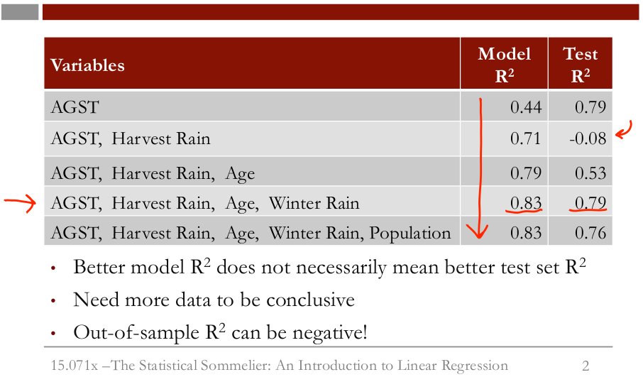
  
We can compute the test set R-squared for several different models. This table shows the model R-squared and the test set R-squared for the linear regression model as we add more independent variables. The model R-squared will always increase or stay the same as we add more independent variables.
However, this is not true for the test set. When selecting a model, we want one with a good model R-squared but also with a good test set R-squared. It looks like our model that uses AGST, HarvestRain, Age, and WinterRain does very well on the training data and on the test data.  
  
But **for this example, we need more data to be conclusive since two data points in the test set is not really enough to reach any conclusions**!  
  
Also, note here that the test set R-squared can actually be negative. The model R-squared is never negative since our model can't do worse on the training data than the baseline model. However, our model can do worse on the test data compared to the baseline model, leading to a negative R-squared value.  
  

=== DRAFT ZONE ===

# TODO:
1) Add cross-references between files


# Linear regression workflow:

1) Make model using train data
2) Investigate and improve model (replace nonsignificance variables)
remove the one with the largest "p-value" first, or the one with the "t value" closest to zero)
Remove them one at a time (this is called "backwards variable selection").
3) Make prediction on test data. 
4) Estimate the goodness of prediction via out-of-sample R-squared
 - formula for SSE
 - formula for SST
 - formula for R-squared

About removing variables:
So when we force the variable to be removed, it will decrease the R-squared a little bit. However, this small decrease is worth it to have a simpler model.

# Terminology:
Sum of Squared Errors (SSE) is ... $a^2 + b^2 = c^2$
Total Sum of Squared (SST) is ...
Out-of-sample R-squared is ...
R-squared is ...
Adjusted R squared is ...
Multicollinearity is ...
add cross-reference!
