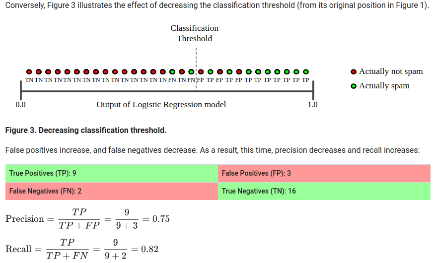

 ---
title: "Logistic Regression"
output: html_document
---

```{r setup, include=FALSE}
knitr::opts_chunk$set(echo = TRUE)
```

Make bookdown!!!
Slides are here!

# **Logistic Regression**  

  
  
to predict the probability that y = 1,
we use what's called the Logistic Response Function. The Logistic Response Function is
used to produce a number between 0 and 1.

# **Understanding the Logistic Function**  

  
  
The logistic response function always takes values between 0 and 1, which makes sense, since it equals a probability.  
  
A positive coefficient value for a variable increases the linear regression piece, which increases the probability that y = 1,
or increases the probability of poor care.  
On the other hand, a negative coefficient value for a variable decreases the linear regression piece, which in turn decreases the probability that y = 1, or increases the probability of good care.  


  
  
The coefficients, or **betas**, are selected to predict a high probability for the actual poor care cases, and to predict a low probability for the actual good care cases.  


# **The Logit**  


  
By taking the log of both sides, the log(Odds), or what we call the Logit, looks exactly like the linear regression equation.
This helps us understand how the coefficients, or betas, affect our prediction of the probability.  
A positive beta value increases the Logit, which in turn increases the Odds of one.  
A negative beta value decreases the Logit, which in turn, decreases the Odds of one.  

# **Threshold value**


There are two types of errors that a model can make -- ones where you predict 1, or poor care, but the actual outcome is 0, and ones where you predict 0, or good care, but the actual outcome is 1. If we pick a large threshold value t, then we will predict poor care rarely, since the probability of poor care has to be really large to be greater than the threshold. This means that we will make more errors where we say good care, but it's actually poor care. This approach would detect the patients receiving the worst care and prioritize them for intervention.  
  
On the other hand, if the threshold value, t, is small, we predict poor care frequently, and we predict good care rarely. This means that we will make more errors where we say poor care, but it's actually good care. This approach would detect all patients who might be receiving poor care.  
  
Some decision-makers often have a preference for one type of error over the other, which should influence the threshold value they pick.
If there's no preference between the errors, the right threshold to select is t = 0.5, since it just predicts the most likely outcome.
  
## **Confusing Matrix**  
  


Чтобы рассуждать о том, у какой ошибки какая цены, удобно ввести матрицу ошибок, которая производит некоторую классификацию типов ошибок. Она состоит из двух строк и двух столбцов. Строка зависит от того, какой ответ выдаёт наш алгоритм, наша модель. Первая строка соответствует объектам, которых наша модель относит к классу +1. Вторая строка соответствует объектам, которых наша модель относит к классу -1. Столбец зависит от того, к какому классу на самом деле относится объект. Если объект относится к классу 1,
он попадает в первый столбец. Если объект относится к классу -1, он попадает во второй столбец.  
  

  
## **Metrics: Precision, Recall, F-metrics**
  

  
... or what proportion of positive identifications was actually correct?
    

  
... or what proportion of actual positives was identified correctly?  
    
Давайте разберём два примера того, как можно пользоваться точностью и полнотой в совокупности. Первый пример про кредитный скоринг. Представьте, что руководство банка решило, что, если среди всех выданных кредитов не более 5 % будут ошибочными, то есть лишь 5 % из них не вернут, то такая схема не будет убыточной. Эти невозвращённые кредиты не дадут нам слишком много убытков. Таким образом, мы получаем ограничение на точность в 0.95. Точность должна быть большу, чем 0.95. И при таком ограничении мы будем максимизировать полноту, то есть **стараться выдать кредиты как можно большему количеству хороших заёмщиков**.
  
Второй пример про медицинскую диагностику. Представьте, что мы сделали модель, хотим сделать модель, которая определяет: есть или нет то или иное заболевание у пациента. При этом наш заказчик требует, чтобы среди всех протестированных пациентов мы выделили как минимум 80 % тех, которые действительно имеют это заболевание. Таким образом, мы получаем ограничение, что полнота должна быть не меньше, чем 80 %. И при этом ограничении мы будет максимизировать точность, то есть пытаться сделать как можно меньше число ложных срабатываний.  
  
## Precision with Recall: unbalansed sampales
  

  
Наконец, обратите внимание, как точность и полнота работают на несбалансированных выборках. Представьте, что у нас есть выборка, в которой сто объектов первого класса и более десяти тысяч объектов отрицательного класса, -1 класса. При этом у нас 10 верных срабатываний, 20 ложных срабатываний и 90 ложных пропусков. Доля верных ответов на данной выборке равняется 99 %. Скорее всего, это число ни о чём не говорит. Чтобы понять, что плохого с данным алгоритмом, нужно померить точность и полноту. Давайте измерим точность. Всего алгоритм срабатывает на тридцати объектах, и из них лишь 10 — это верные срабатывания, значит точность равна 33 %. Видно, что алгоритм делает слишком много ложных срабатываний — 66 %. Далее полнота. Всего в выборке сто объектов первого класса, из их них лишь на 10 алгоритм срабатывает. Таким образом, полнота равняется 10 %. Видно, что у него также много ложных пропусков. Он пропускает 90 % объектов первого класса. Благодаря точности и полноте мы можем видеть, что не так с этим алгоритмом и что можно пытаться улучшить.  
  
## Precision vs. Recall: changing of threshold
  
To fully evaluate the effectiveness of a model, you must examine both precision and recall. Unfortunately, precision and recall are often in tension. That is, improving precision typically reduces recall and vice versa. Explore this notion by looking at the following figure, which shows 30 predictions made by an email classification model. Those to the right of the classification threshold are classified as "spam", while those to the left are classified as "not spam."  


  

  

  
## F-measure
  
The traditional F-measure or balanced F-score (F1 score) is the harmonic mean of precision and recall.

  

  
При этом, если вы хотите отдать предпочтение либо точности, либо полноте, можно воспользоваться расширенной версией F-меры, который имеет параметр β. При этом, если вы возьмёте β = 0.5, то важнее окажется полнота. Дело в том, что если вы зафиксируете полноту и будете менять точность, то данная F-мера будет меняться довольно гладко.  
Если же вы зафиксируете точность и будете менять полноту, изменения будут очень резкие. Таким образом, полнота важнее в этом случае.  
  
Если же взять β = 2, то ситуация поменяется. Важнее окажется точность. Поскольку при фиксированной полноте изменение точности будет гораздо сильнее приводить к перемене F-меры.  
  
## Other metrics: Sensitivity and Specificity

To make this discussion a little more quantitative, we use what's called a confusion matrix or classification matrix. This compares the actual outcomes to the predicted outcomes.  


  
The rows are labeled with the actual outcome, and the columns are labeled with the predicted outcome. Each entry of the table gives the number of data observations that fall into that category.  
  
So the number of **True Negatives**, or **TN**, is the number of observations that are actually good care and for which we predict good care. The **True Positives**, or **TP**, is the number of observations that are actually poor care and for which we predict poor care. These are the two types that we get correct.  
  
The **False Positives**, or **FP**, are the number of data points for which we predict poor care, but they're actually good care. And the **False Negatives**, or **FN**, are the number of data points for which we predict good care, but they're actually poor care.  

We can compute two outcome measures that help us determine what types of errors we are making. They're called **sensitivity** and **specificity**.  
  
**Sensitivity** is equal to the true positives divided by the true positives plus the false negatives, and **measures the percentage of actual poor care cases that we classify correctly**. This is often called the **True Positive Rate**.  
  
**Specificity** is equal to the true negatives divided by the true negatives plus the false positives, and **measures the percentage of actual good care cases that we classify correctly**. This is often called the **True Negative Rate**.  
  
A model with a higher threshold will have a lower sensitivity and a higher specificity.  
A model with a lower threshold will have a higher sensitivity and a lower specificity.  

# **Receiver Operator Characteristic (ROC) Curves**
  
  

Picking a good threshold value is often challenging. A Receiver Operator Characteristic curve, or ROC curve, can help you decide which value of the threshold is best.  


По оси x откладывается доля ложных срабатываний, или **False Positive Rate**. Она считается как **отношение числа ложных срабатываний к общему размеру отрицательного класса**, то есть False Positives + True Negatives.  
По оси y будем откладывать долю верных срабатываний, или **True Positive Rate**. В числителе стоит количество верных срабатываний, в знаменателе — размер первого класса, то есть True Positive + False Negative.  

The ROC curve for our problem is shown on the right of this slide. The sensitivity, or true positive rate of the model, is shown on the y-axis.
And the false positive rate, or 1 minus the specificity, is given on the x-axis. The line shows how these two outcome measures vary with different threshold values.  
  
The ROC curve always starts at the point (0, 0). This corresponds to a threshold value of 1. If you have a threshold of 1, you will not catch any poor care cases, or have a sensitivity of 0. But you will correctly label of all the good care cases, meaning you have a false positive rate of 0.  

The ROC curve always ends at the point (1,1), which corresponds to a threshold value of 0. If you have a threshold of 0, you'll catch all of the poor care cases, or have a sensitivity of 1, but you'll label all of the good care cases as poor care cases too, meaning you have a false positive rate of 1. The threshold decreases as you move from (0,0) to (1,1).  
  
At the point (0, 0.4) you're correctly labeling about 40% of the poor care cases with a very small false positive rate. On the other hand, at the point (0.6, 0.9), you're correctly labeling about 90% of the poor care cases, but have a false positive rate of 60%. In the middle, around (0.3, 0.8), you're correctly labeling about 80% of the poor care cases, with a 30% false positive rate.  

  
The ROC curve captures all thresholds simultaneously. The higher the threshold, or closer to (0, 0), the higher the specificity and the lower the sensitivity. The lower the threshold, or closer to (1,1), the higher the sensitivity and lower the specificity.  
  


So which threshold value should you pick? You should select the best threshold for the trade-off you want to make.  
If you're more concerned with having a high specificity or low false positive rate, pick the threshold that maximizes the true positive rate while keeping the false positive rate really low. A threshold around (0.1, 0.5) on this ROC curve looks like a good choice in this case.  
On the other hand, if you're more concerned with having a high sensitivity or high true positive rate, pick a threshold that minimizes the false positive rate but has a very high true positive rate. A threshold around (0.3, 0.8) looks like a good choice in this case.  
  
You can label the threshold values in R by color-coding the curve. The legend is shown on the right. This shows us that - say we want to pick a threshold value around here. This corresponds to between the aqua color and the green color. Or it looks like about a threshold of 0.3. Instead, if we wanted to pick a threshold around here, this looks like the start of the darker blue color, and looks like it's probably a threshold around 0.2.We can also add specific threshold labels to the curve in R. This helps you see which threshold value you want to use.
  
See how to label the threshold values in R by color-coding the curve in **logistic_regression_in_r.Rmd**
  

  
# Logistic regression workflow:


# Terminology:
Logistic Response Function is ... 
