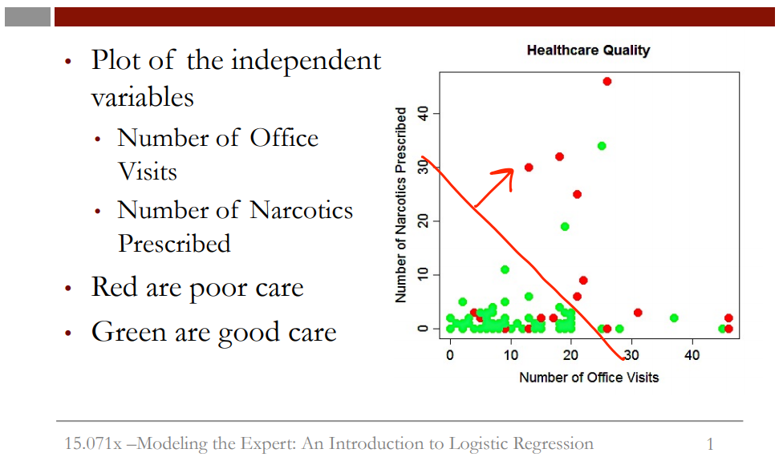

```{r setup, include=FALSE}
knitr::opts_chunk$set(echo = TRUE)

library(tidyverse)
library(ROCR)
```

In this video, we'll be using the dataset **quality.csv** to build a logistic regression model in R. Please download this file to follow along.  
  
The variables in the dataset **quality.csv** are as follows:  
  
+ **MemberID** numbers the patients from 1 to 131, and is just an identifying number.  
+ **InpatientDays** is the number of inpatient visits, or number of days the person spent in the hospital.  
+ **ERVisits** is the number of times the patient visited the emergency room.  
+ **OfficeVisits** is the number of times the patient visited any doctor's office.  
+ **Narcotics** is the number of prescriptions the patient had for narcotics.  
+ **DaysSinceLastERVisit** is the number of days between the patient's last emergency room visit and the end of the study period (set to the length of the study period if they never visited the ER).  
+ **Pain** is the number of visits for which the patient complained about pain.  
+ **TotalVisits** is the total number of times the patient visited any healthcare provider.  
+ **ProviderCount** is the number of providers that served the patient.  
+ **MedicalClaims** is the number of days on which the patient had a medical claim.  
+ **ClaimLines** is the total number of medical claims.  
+ **StartedOnCombination** is whether or not the patient was started on a combination of drugs to treat their diabetes (TRUE or FALSE).  
+ **AcuteDrugGapSmall** is the fraction of acute drugs that were refilled quickly after the prescription ran out.  
+ **PoorCare** is the outcome or dependent variable, and is equal to 1 if the patient had poor care, and equal to 0 if the patient had good care.  
  
In this video we learned how to use the sample.split() function from the caTools package to split data for a classification problem, balancing the positive and negative observations in the training and testing sets.  
  
If you wanted to instead split a data frame data, where the dependent variable is a continuous outcome (this was the case for all the datasets we used last week), you could instead use the sample() function. Here is how to select 70% of observations for the training set (called "train") and 30% of observations for the testing set (called "test"):  

spl = sample(1:nrow(data), size=0.7 * nrow(data))  
train = data[spl,]  
test = data[-spl,]  
  
  

# **Model for Healthcare Quality**  

 
  
This plot shows two of our independent variables, the number of office visits on the x-axis and the number of narcotics prescribed on the y-axis. Each point is an observation or a patient in our data set. The red points are patients who received poor care, and the green points are patients who received good care. It's hard to see a trend in the data by just visually inspecting it. But it looks like maybe more office visits and more narcotics, or data points to the right of this line, are more likely to have poor care. Let's see if we can build a logistic regression model in R to better predict poor care.  
  
Load our dataset
```{r}
quality <- read.csv("data/quality.csv")
```
Let's take a look at the structure  
```{r}
glimpse(quality)
```
We have 131 observations, one for each of the patients in our data set, and 14 different variables. **MemberID** just numbers the patients from 1 to 131. The 12 variables from **InpatientDays** to **AcuteDrugGapSmall** are the independent variables. We'll be using the number of office visits and the number of prescriptions for narcotics that the patient had.  
  
Let's see how many patients received poor care and how many patients received good care by using the table function. Let's make a table of our outcome variable PoorCare.  
```{r}
table(quality$PoorCare)
```
    
## Baseline for logistic regression  

Before building any models, let's consider using a simple baseline method. In a classification problem, a standard baseline method is to just predict the most frequent outcome for all observations. Since good care is more common than poor care, in this case, we would predict that all patients are receiving good care.  
  
If we did this, we would get 98 out of the 131 observations correct, or have an accuracy of about 75%. So our baseline model has an accuracy of 75%. This is what we'll try to beat with our logistic regression model.  

## Split data into train and testing set  
  
Last week, we always gave you the training data set and the testing data set in separate files. This week, we only have one data set. So we want to randomly split our data set into a training set and testing set so that we'll have a test set to measure our out-of-sample accuracy.
We'll use for this **caTools** package.  
```{r}
library(caTools)

set.seed(88)
split <- sample.split(quality$PoorCare, SplitRatio = 0.75)
```
The first is our outcome variable or quality$PoorCare, and the second argument is the percentage of the data that we want in the training set. We type SplitRatio equals, and in this case, we'll put 75% of the data in the training set, which we'll use to build the model, and 25% of the data in the testing set to test our model.  
  
Sample.split randomly splits the data. But it also makes sure that the outcome variable is well-balanced in each piece. We saw earlier that about 75% of our patients are receiving good care. This function makes sure that in our training set, 75% of our patients are receiving good care and in our testing set 75% of our patients are receiving good care. We want to do this so that our test set is representative of our training set.  
  
Let's take a look at split:
```{r}
split
```
There is a TRUE or FALSE value for each of our observations. TRUE means that we should put that observation in the training set, and FALSE means that we should put that observation in the testing set. So now let's create our training and testing sets using the subset function.  
  
We'll call our training set qualityTrain and use the subset function to take a subset of quality and only taking the observations for which split is equal to TRUE.
```{r}
qualityTrain <- subset(quality, split == TRUE)
```
We'll call our testing set qualityTest and, again, use the subset function to take the observations of quality, but this time those for which split is equal to FALSE.
```{r}
qualityTest <- subset(quality, split == FALSE)
```
If you look at the number of rows in each of our data sets, the training set and then the testing set, you can see that there are 99 observations in the training set and 32 observations in the testing set.
```{r}
c(`# of train`= nrow(qualityTrain),
  `# of test` = nrow(qualityTest),
  `Train proportion` = nrow(qualityTrain) / nrow(quality),
  `Test proportion` = nrow(qualityTest) / nrow(quality))
```
  
## Build the logistic regression model
  
Now, we are ready to build a logistic regression model using **OfficeVisits** and **Narcotics** as independent variables.  
We'll call our model QualityLog and use the "glm" function for "generalized linear model" to build our logistic regression model.  
For a logistic regression model, we need one more argument, which is **family = binomial**. This tells the glm function to build a logistic regression model.
```{r}
QualityLog <- glm(PoorCare ~ OfficeVisits + Narcotics, data = qualityTrain, family = binomial)
```
Now, let's look at our model using the summary function.
```{r}
summary(QualityLog)
```
We see here that the coefficients for **OfficeVisits** and **Narcotics** are both positive, which means that higher values in these two variables are indicative of poor care as we suspected from looking at the data. We also see that both of these variables have at least one star, meaning that they're significant in our model.  
  
The last thing we want to look at in the output is the **AIC** value. This is a **measure of the quality of the model** and is like Adjusted R-squared in that it accounts for the number of variables used compared to the number of observations. Unfortunately, it can only be compared between models on the same data set. But it provides a means for model selection. The preferred model is the one with the minimum AIC.  
  
## Make predictions  
  
Now, let's make predictions on the training set. We'll call them predictTrain and use the predict function to make predictions using the model QualityLog, and we'll give a second argument, which is type="response". This tells the predict function to give us probabilities.  
```{r}
predictTrain <- predict(QualityLog, type = "response")
```

## Understanding result  
  
Choose actual data from our dataset:
```{r}
qualityTrain %>% 
  select(MemberID, Narcotics, TotalVisits, PoorCare) %>% 
  View()
```
Make tibble from prediction vector:
```{r}
PredicTibble <- predictTrain %>% as.tibble()
```
Merge PredicTibble into our Test data:
```{r}
qualityTrain %>% 
  select(MemberID, Narcotics, TotalVisits, PoorCare) %>% 
  cbind(PredicTibble) %>% 
  View()
```


## Analysing of prediction result
  
Let's take a look at the statistical summary of our predictions.
```{r}
summary(predictTrain)
```
Since we're expecting probabilities, all of the numbers should be between zero and one.  
  
Let's see if we're predicting higher probabilities for the actual poor care cases as we expect. To do this, use the tapply function, giving as arguments predictTrain and then QualityTrain$PoorCare and then mean. This will compute the average prediction for each of the true outcomes.
```{r}
tapply(predictTrain, qualityTrain$PoorCare, mean)
```
So we see that for all of the true poor care cases, we predict an average probability of about 0.44. And all of the true good care cases, we predict an average probability of about 0.19. So this is a good sign, because it looks like we're predicting a higher probability for the actual poor care cases. 

## Quick Question 1  
  
In R, create a logistic regression model to predict **PoorCare** using the independent variables **StartedOnCombination** and **ProviderCount**. Use the training set we created in the previous video to build the model.  

What is the coefficient for "StartedOnCombination"?
```{r}
QualityLog1 = glm(PoorCare ~ StartedOnCombination + ProviderCount, data = qualityTrain, family=binomial)
summary(QualityLog1)
```
## Quick Question 2  
  
**StartedOnCombination** is a binary variable, which equals 1 if the patient is started on a combination of drugs to treat their diabetes, and equals 0 if the patient is not started on a combination of drugs. All else being equal, does this model imply that starting a patient on a combination of drugs is indicative of poor care, or good care?

**Answer:** Poor Care (positive coefficient)

## Compute some confusion matrices
  
In our R console, let's make some classification tables using different threshold values and the table function. First, we'll use a threshold value of 0.5. This will return TRUE if our prediction is greater than 0.5, which means we want to predict poor care, and it will return FALSE if our prediction is less than 0.5, which means we want to predict good care.
```{r}
table(qualityTrain$PoorCare, predictTrain > 0.5)
```
We get a table where the rows are labeled by 0 or 1, the true outcome, and the columns are labeled by FALSE or TRUE, our predicted outcome. So you can see here that for 70 cases, we predict good care and they actually received good care, and for 10 cases, we predict poor care, and they actually received poor care. We make four mistakes where we say poor care and it's actually good care, and we make 15 mistakes where we say good care, but it's actually poor care.  
  
Let's compute the sensitivity, or the true positive rate
```{r}
10/(15 + 10)
```
... and the specificity, or the true negative rate
```{r}
70/(70 + 4) 
```
Now, let's try increasing the threshold up to 0.7:
```{r}
table(qualityTrain$PoorCare, predictTrain > 0.7)
```
Now sensitivity is:
```{r}
8/(17 + 8)
```
... and specifity is:
```{r}
73/(73 + 1)
```
  
# **ROC curve practice**
  
Let's go into R and see how to generate these ROC curves.  
  
First, we'll call the prediction function of ROCR. We'll call the output of this function ROCRpred, and then use the prediction function. This function takes two arguments. The first is the predictions we made with our model, which we called predictTrain. The second argument is the true outcomes of our data points, which in our case, is qualityTrain$PoorCare.
```{r}
ROCRpred <- prediction(predictTrain, qualityTrain$PoorCare)
```
Now, we need to use the performance function. This defines what we'd like to plot on the x and y-axes of our ROC curve. We'll call the output of this ROCRperf, and use the performance function, which takes as arguments the output of the prediction function, and then what we want on the x and y-axes. In this case, it's true positive rate, or "tpr", and false positive rate, or "fpr".  
```{r}
ROCRperf <- performance(ROCRpred, "tpr", "fpr")
```
Now, we just need to plot the output of the performance function, ROCRperf.
```{r}
plot(ROCRperf, colorize = TRUE, print.cutoffs.at=seq(0,1,0.1), text.adj=c(-0.2,1.7))
```
  
## Quick Question
  
1) Given this ROC curve, which threshold would you pick if you wanted to correctly identify a small group of patients who are receiving the worst care with high confidence?  
Variants: 
+ t = 0.2
+ t = 0.3
+ t = 0.7
+ t = 0.8  

**Answer:** t = 0.7  
  
2) Which threshold would you pick if you wanted to correctly identify half of the patients receiving poor care, while making as few errors as possible?  
**Answer:** t = 0.3  
  
3) Compute the test set predictions in R by running the command:
```{r}
predictTest <- predict(QualityLog, type="response", newdata=qualityTest)
```
You can compute the test set AUC by running the following two commands in R:
```{r}
ROCRpredTest <- prediction(predictTest, qualityTest$PoorCare)
auc <- performance(ROCRpredTest, "auc")
auc@y.values[[1]]
```
