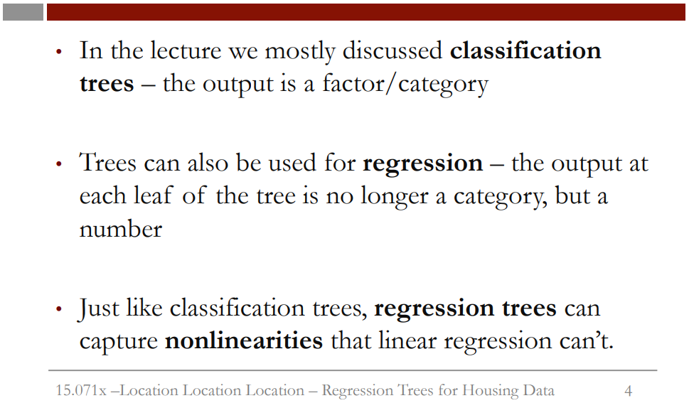
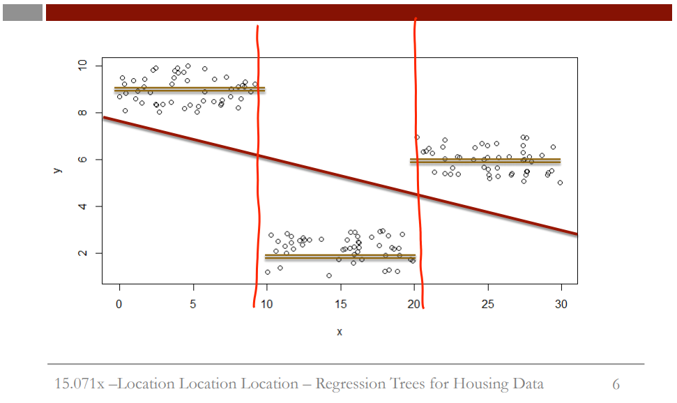
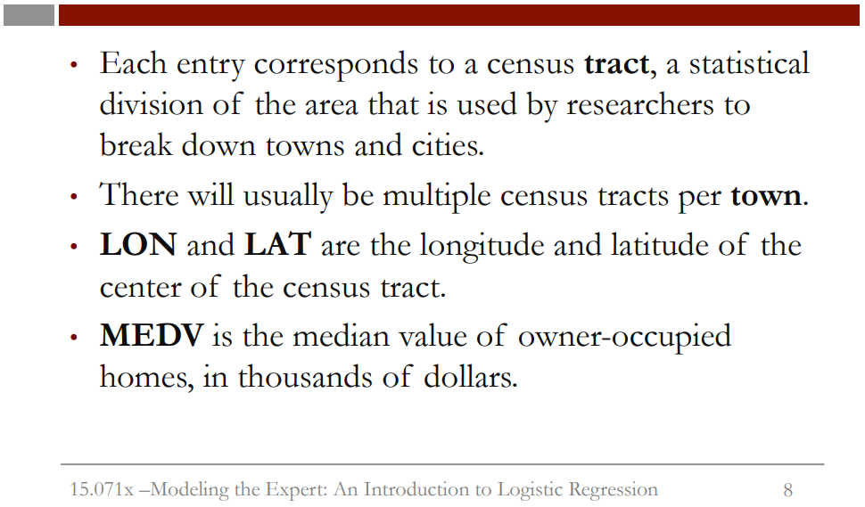
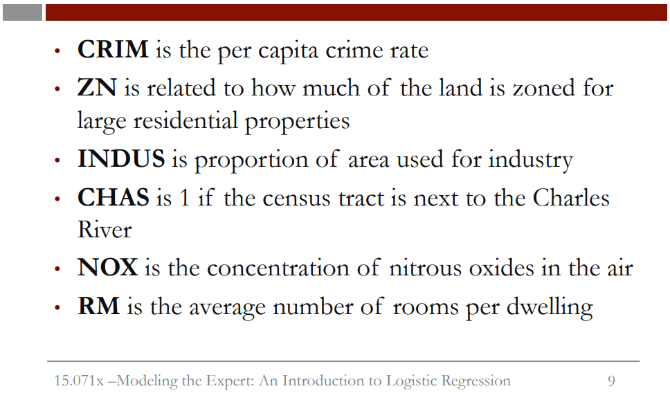
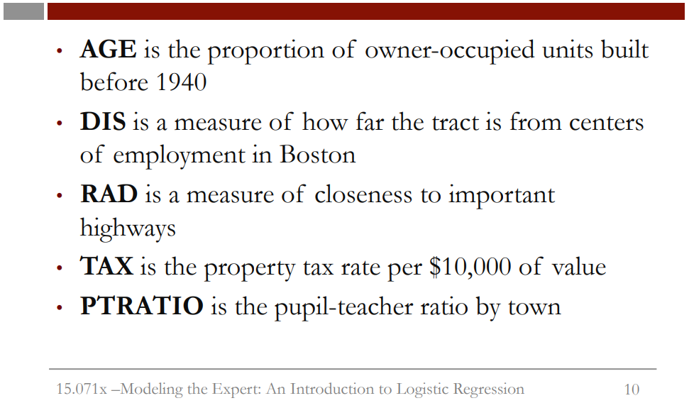

```{r setup, include=FALSE}
knitr::opts_chunk$set(echo = TRUE)

library(tidyverse)
library(caTools)
library(rpart)
library(rpart.plot)
library(caret)
library(e1071)
```

# Intro 
  
In this recitation, we will be talking about Boston in a sense of the greater Boston area. However, if we look at the housing in Boston right now, we can see that it is very dense. Over the greater Boston area, the nature of the housing varies widely.  
  
This data comes from a paper, "Hedonic Housing Prices and the Demand for Clean Air," which has been cited more than 1,000 times. This paper was written on a relationship between house prices and clean air in the late 1970s by David Harrison of Harvard and Daniel Rubinfeld of the University of Michigan. The data set is widely used to evaluate algorithms of a nature we discuss in this class.  
  

  
Now, in the lecture, we mostly discuss classification trees with the output as a factor or a category. Trees can also be used for regression tasks. The output at each leaf of a tree is no longer a category, but a number. Just like classification trees, regression trees can capture
nonlinearities that linear regression can't.  
  
With regression trees, we now have continuous variables. So instead of-- we report the average of the values at that leaf. So suppose we had the values 3, 4, and 5 at one of the leaves of our trees. Well, we just take the average of these numbers, which is 4, and that is what we report. That might be a bit confusing so let's look at a picture.  
  

  
Here is some fake data that I made up in R. We see x on the x-axis and y on the y-axis. y is our variable we are trying to predict using x. So if we fit a linear regression to this data set, we obtain the following line. As you can see, linear regression does not do very well on this data set. However, we can notice that the data lies in three different groups.  
If we draw these lines here, we see x is either less than 10, between 10 and 20, or greater then 20, and there is very different behavior in each group. Regression trees can fit that kind of thing exactly. So the splits would be x is less than or equal to 10, take the average of those values. x is between 10 and 20, take the average of those values. x is between 20 and 30, take the average of those values.  
  
We see that regression trees can fit some kinds of data very well that linear regression completely fails on. Of course, in reality nothing is ever so nice and simple, but it gives us some idea why we might be interested in regression trees.  
  
So in this recitation, we will explore the data set with the aid of trees. We will compare linear regression with regression trees. We will discuss what the cp parameter means that we brought up when we did cross-validation in the lecture, and we will apply cross-validation to regression trees.  
  
## The Data  
    
Before we jump into R, let's understand the data. Each entry of this data set corresponds to a census tract, a statistical division of the area that
is used by researchers to break down towns and cities. As a result, there will usually be multiple census tracts per town.  
  





    
So let's begin to analyze our data set with R. First of all, we'll load the data set into the Boston variable.
```{r}
boston <- read.csv("data/boston.csv")
str(boston)
```
We are interested in building a model initially of how prices vary by location across a region. So let's first see how the points are laid out.
Using the plot commands, we can plot the latitude and longitude of each of our census tracts.  
```{r}
plot(boston$LON, boston$LAT)
```
So we want to show all the points that lie along the Charles River in a different color. We have a variable, CHAS, that tells us if a point is on the Charles River or not. So to put points on an already-existing plot, we can use the points command, which looks very similar to the plot command,
except it operates on a plot that already exists. So let's plot just the points where the Charles River variable is set to one.  
```{r}
plot(boston$LON, boston$LAT)
points(boston$LON[boston$CHAS == 1], boston$LAT[boston$CHAS == 1], col = "blue", pch = 19)
```
  
## Geographical Predictions 
  
So, we saw in the previous video that the house prices were distributed over the area in an interesting way, certainly not the kind of linear way.
And we wouldn't necessarily expect linear regression to do very well at predicting house price, just given latitude and longitude. We can kind of develop that intuition more by plotting the relationship between latitude and house prices-- which doesn't look very linear-- or the longitude
and the house prices, which also looks pretty nonlinear. So, we'll try fitting a linear regression anyway. So, let's call it latlonlm.  
```{r}
latlonlm <- lm(MEDV ~ LAT + LON, data = boston)
summary(latlonlm)
```
If we take a look at our linear regression, we see the R-squared is around 0.1, which is not great. The latitude is not significant, which means the north-south differences aren't going to be really used at all. Longitude is significant, and it's negative. Which we can interpret as, as we go towards the ocean -- as we go towards the east-- house prices decrease linearly. So this all seems kind of unlikely, but let's work with it.  
```{r}
ggplot(data = boston, aes(LON, LAT, color = MEDV >= 21.2)) +
  geom_point()
```
  
## Regression Trees
  
In this video, Iain shows a different way to plot a CART tree - by using the plot and text functions instead of the prp function. This is just another way to visualize the CART tree, and shows the tree in a slightly different way. Both are valid options for plotting your CART trees.  
```{r}
LatLonTree <- rpart(MEDV ~ LAT + LON, data = boston)
prp(LatLonTree)
```
If we now plot the tree using the prp command, which is defined in rpart.plot, we can see it makes a lot of splits and is a little bit hard to interpret. But the important thing is to look at the leaves. In a classification tree, the leaves would be the classification we assign that these splits would apply to. But in regression trees, we instead predict the number. That number is the average of the median house prices in that bucket or leaf. So let's see what that means in practice. So we'll plot again the latitude of the points.  
```{r}
boston$LotLanTree <- predict(LatLonTree)
ggplot(data = boston, aes(LON, LAT, fill = MEDV >= 21.2, shape = LotLanTree >= 21.2)) +
  geom_point() +
  scale_shape_manual(values = c(21, 24)) +
  scale_fill_manual(values = c(NA, "black"))
```
Now we see that we've done a much better job than linear regression was able to do. We've correctly left the low value area in Boston and below out, and we've correctly managed to classify some of those points in the bottom right and top right. We're still making mistakes, but we're able to make a nonlinear prediction on latitude and longitude. So that's interesting, but the tree was very complicated. So maybe it's drastically overfitting.
Can we get most of this effect with a much simpler tree? We can. We would just change the minbucket size.  
```{r}
LatLonTree <- rpart(MEDV ~ LAT + LON, data = boston, minbucket = 50)
prp(LatLonTree, digits = 4, extra = 1)
```
And we see we have far fewer splits, and it's far more interpretable. The first split says if the longitude is greater than or equal to negative 71.07 -- so if you're on the right side of the picture.
```{r}
ggplot(data = boston, aes(LON, LAT, color = MEDV >= 21.2)) +
  geom_point() +
  geom_vline(xintercept = -71.07) +
  geom_hline(yintercept = 42.21) +
  geom_hline(yintercept = 42.17)
```
So the first split was on longitude, and it was negative 71.07. So there's a very handy command, "abline," which can plot horizontal or vertical lines easily. So we're going to plot a vertical line, so v, and we wanted to plot it at negative 71.07. OK. So that's that first split from the tree.
It corresponds to being on either the left or right-hand side of this tree. We'll plot the-- what we want to do is, we'll focus on one area.
We'll focus on the lowest price prediction, which is in the bottom left corner of the tree, right down at the bottom left after all those splits.
So that's where we want to get to. So let's plot again the points. Plot a vertical line. The next split down towards that bottom left corner
was a horizontal line at 42.21. So I put that in. That's interesting. So that line corresponds pretty much to where the Charles River was from before. The final split you need to get to that bottom left corner I was pointing out is 42.17. It was above this line. And now that's interesting.
If we look at the right side of the middle of the three rectangles on the right side, that is the bucket we were predicting. And it corresponds to that rectangle, those areas. That's the South Boston low price area we saw before. So maybe we can make that more clear by plotting, now,
the high value prices. So let's go back up to where we plotted all the red dots and overlay it.

## Linear Regression and Trees
  
In the previous video, we got a feel for how regression trees can do things linear regression cannot. But what really matters at the end of the day is whether it can predict things better than linear regression. And so let's try that right now. We're going to try to predict house prices using all the variables we have available to us.  
```{r}
set.seed(120)
spl <- sample.split(boston$MEDV, SplitRatio = 0.7)
train <- subset(boston, spl == TRUE)
test <- subset(boston, spl == FALSE)
```
OK, first of all, let's make a linear regression model, nice and easy.
```{r}
linreg <- lm(MEDV ~ LAT + LON + CRIM + ZN + INDUS + CHAS + NOX + RM + AGE + DIS + RAD + TAX + PTRATIO, data = train)
summary(linreg)
```
OK, let's see what our linear regression looks like. So we see that the latitude and longitude are not significant for the linear regression, which is perhaps not surprising because linear regression didn't seem to be able to take advantage of them. Crime is very important. The residential zoning might be important. Whether it's on the Charles River or not is a useful factor. Air pollution does seem to matter -- the coefficient is negative, as you'd expect. The average number of rooms is significant. The age is somewhat important. Distance to centers of employment (DIS), is very important. Distance to highways and tax is somewhat important, and the pupil-teacher ratio is also very significant.
Some of these might be correlated, so we can't put too much stock in necessarily interpreting them directly, but it's interesting.  
  
So because it's kind of hard to compare out of sample accuracy for regression, we need to think of how we're going to do that. Let's calculate the sum of squared error, which we discussed in the original linear regression video.  
```{r}
linreg.pred <- predict(linreg, newdata = test)
linreg.sse <- sum((linreg.pred - test$MEDV)^2)
linreg.sse
```
##**NOTE**## Незрозуміло з розбивкою датасетів на тренувальний і тестовий: вони вийшли однаковими, через те що змінна MEDV формата num!!!
  
So you know what we're interested to see now is, can we beat this using regression trees? So let's build a tree.  
```{r}
tree <- rpart(MEDV ~ LAT + LON + CRIM + ZN + INDUS + CHAS + NOX + RM + AGE + DIS + RAD + TAX + PTRATIO, data = train)
prp(tree)
```
So again, latitude and longitude aren't really important as far as the tree's concerned. The rooms are the most important split. Pollution appears in there twice, so it's, in some sense, nonlinear on the amount of pollution -- if it's greater than a certain amount or less than a certain amount, it does different things. Crime is in there, age is in there. Room appears three times, actually-- sorry. That's interesting.
So it's very nonlinear on the number of rooms. Things that were important for the linear regression that don't appear in ours include pupil-teacher ratio. The DIS variable doesn't appear in our regression tree at all, either.  
So they're definitely doing different things, but how do they compare?  
So we'll predict, again, from the tree "tree.pred" is the prediction of the tree on the new data.
```{r}
tree.pred <- predict(tree, newdata = test)
tree.sse <- sum((tree.pred - test$MEDV)^2)
tree.sse
```
What this says to us, given what we saw with the latitude and longitude, is that latitude and longitude are nowhere near as useful for predicting, apparently, as these other variables are. That's just the way it goes, I guess. It's always nice when a new method does better, but there's no guarantee that's going to happen. We need a special structure to really be useful.
  
# Cross-Validation  
  
OK, so now we know what CP is, we can go ahead and build one last tree using cross validation.  
So we need to tell the caret package how exactly we want to do our parameter tuning. There are actually quite a few ways of doing it. But we're going to restrict ourselves in this course to just 10-fold cross validation, as was explained in the lecture.  
```{r}
tr.control <- trainControl(method = "cv", number = 10)
```
Now we need to tell caret which range of **cp** parameters to try out. Now remember that cp varies between 0 and 1. It's likely for any given problem that we don't need to explore the whole range. I happen to know, by the fact that I made this presentation ahead of time, that the value of cp we're going to pick is very small. So what I want to do is make a grid of cp values to try. And it will be over the range of 0 to 0.01.
```{r}
cp.grid <- expand.grid(.cp = (0:10)*0.001)
cp.grid
```
So 0 to 10 times 0.001 is those numbers scaled by 0.001. So those are the values of cp that caret will try. So let's store the results of the cross validation fitting in a variable called tr.
```{r}             
tr <- train(MEDV ~ LAT + LON + CRIM + ZN + INDUS + CHAS + NOX + RM + AGE + DIS + RAD + TAX + PTRATIO,
            data = train,
            method = "rpart",
            trControl = tr.control,
            tuneGrid = cp.grid)
tr
```
You can see it tried 11 different values of cp. And it decided that cp equals 0.001 was the best because it had the best RMSE-- Root Mean Square Error. And it was 5.03 for 0.001. You see that it's pretty insensitive to a particular value of cp. So it's maybe not too important. It's interesting though that the numbers are so low. I tried it for a much larger range of cp values, and the best solutions are always very close to 0. So it wants us to build a very detail-rich tree.  
```{r}
best.tree <- tr$finalModel
prp(best.tree)
```
You can see that it looks pretty much like the same tree we had before, initially. But then it starts to get much more detailed at the bottom.
And in fact if you can see close enough, there's actually latitude and longitude in there right down at the bottom as well. So maybe the tree is finally going to beat the linear regression model. Well, we can test it out the same way as we did before.  
```{r}
best.tree.pred <- predict(best.tree, newdata = test)
best.tree.sse <- sum((best.tree.pred - test$MEDV)^2)
best.tree.sse
```
So if you can remember from the last video, the tree from the previous video actually only got something in the 4,000s. So not very good.
So we have actually improved. This tree is better on the testing set than the original tree we created. But, you may also remember that the linear regression model did actually better than that still. The linear regression SSE was more around 3,030. So the best tree is not as good as the linear regression model. But cross validation did improve performance. So the takeaway is, I guess, that trees aren't always the best method you have available to you. But you should always try cross validating them to get as much performance out of them as you can. And that's the end of the presentation. Thank you.  
