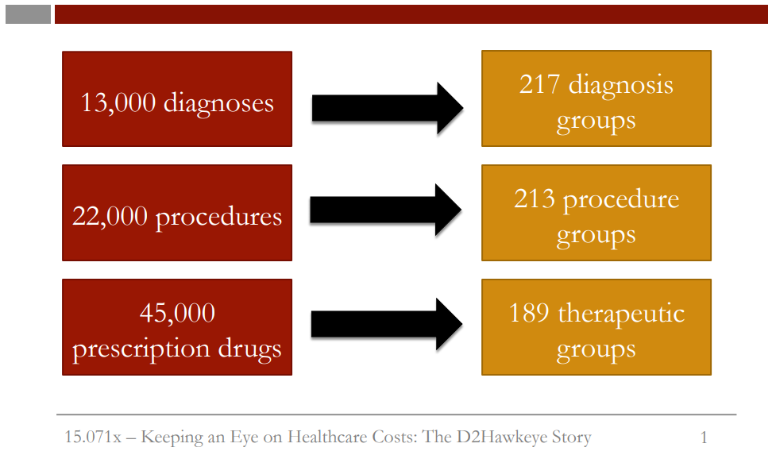

```{r setup, include=FALSE}
knitr::opts_chunk$set(echo = TRUE)

library(tidyverse)
library(caTools)
library(rpart)
library(rpart.plot)
```

# 1. Intro to Problem  
  
## The Variables  
  
To build an analytics model, let us discuss the variables we used.  


  
First, we used the 13,000 diagnoses. It's for the codes for diagnosis that claims data utilize. There were also 22,000 different codes for procedures and 45,000 codes for prescription drugs. To work with this massive amount of variables, we aggregated the variables as follows.
Out of the 13,000 diagnoses, we defined 217 diagnosis groups. Out of the 20,000 procedures, we aggregated the data to develop 213 procedure groups. And, finally, from 45,000 prescription drugs, we developed 189 therapeutic groups.  
  

  
To illustrate an example of how we infer further information from the data, the graph here shows on the horizontal axis, time, and on the vertical axis, costs in thousands of dollars. So patient one is a patient who, on a monthly basis, has costs on the order of 10,000 to 15,000, a fairly significant cost but fairly constant in time.  
Patient two has also an annual cost of a similar size to patient one. But in all but the third month, the costs are almost 0. Whereas in the third month, it cost about 70,000.  
  

  
An important aspect of the variables are the variables related to cost. So rather than using costs directly, we bucketed costs and considered everyone in the group equally. So we defined five buckets. So the buckets were partitioned in such a way so that 20% of all costs is in bucket five, 20% is in bucket four, and so forth.  
So the partitions were from 0 to 3,000, from 3,000 to 8,000, from 8,000 to 19,000, from 19,000 to 55,000, and above 55,000.  
  

  
The number of patients that were below 3,000 was-- 78% of the patients had costs below 3,000. Just to remind you, we created a bucket so that the total cost in each bucket was 20% of the total. But the number of patients in bucket one, for example, is very high (78%).  
  

  
Let us interpret the buckets medically. So this shows the various levels of risk. Bucket one consists of patients that have rather low risk.
Bucket two has what is called emerging risk. In bucket three, moderate level of risk. Bucket four, high risk. And bucket five, very high risk.  
So from a medical perspective, buckets two and three, the medical and the moderate risk patients, are candidates for wellness programs.
Whereas bucket four, the high risk patients, are candidates for disease management programs. And finally bucket five, the very high risk patients, are candidates for case management.  
  
## **Errors Measures**
  
Let us introduce the error measures we used in building the analytics models. We of course used R-squared, but we also used other measures.
Next measure, the so-called "penalty error," is motivated by the fact that if you classify a very high-risk patient as a low-risk patient,
this is more costly than the reverse, namely classifying a low-risk patient as a very high-risk patient.  
  

  
Motivated by this, we developed a penalty error. And the idea is to use asymmetric penalties. The graph here -- shows a matrix -- where this is the outcome and this is the forecast. For example, whenever we classify a low-risk patient as high-risk, we pay a penalty of 2, which is a difference of 3 minus 1, the difference in the error. But inversely, when you classify a bucket 3 patient as bucket 1 patient, this is double. The cost-- the penalty-- is double the amount. So you observe that the off diagonal penalties are double the corresponding penalties in the lower diagonal.  
  
We can interpret this matrix as follows. Suppose the actual outcome for an observation is 3, and we predict 2. We find 3 on the top of the matrix, and go down to the second row (since we forecasted 2). The penalty error for this mistake is 2. If for another observation we predict (forecast) 4, but the actual outcome is 1, that is a penalty error of 3.  
  
**Question:** What is the worst mistake we can make, according to the penalty error matrix?  
+ We predict 5 (very high cost), but the actual outcome is 1 (very low cost)  
+ We predict 1 (very low cost), but the actual outcome is 5 (very high cost) (right answer)  
  
**Explanation.** The highest cost is 8, which occurs when the forecast is 1 (very low cost), but the actual cost is 5 (very high cost). It would be much worse for us to ignore an actual high cost observation than to accidentally predict high cost for someone who turns out to be low cost.  
  
**Question:** What are the "best" types of mistakes we can make, according to the penalty error matrix?  
+ Mistakes where we predict one cost bucket HIGHER than the actual outcome (right answer)  
+ Mistakes where we predict one cost bucket LOWER than the actual outcome.  
  
**Explanation.** We are happier with mistakes where we predict one cost bucket higher than the actual outcome, since this just means we are being a little overly cautious.  
  
## **CART to predict cost**
  
Let us introduce the method we use for predicting the bucket number. It is called-- it is a method called classification and regression trees. In this case, we use multi-class classification.  
  

  
There are five classes, buckets one to five. To give you an example, let us consider patients that have two types of diagnosis: coronary artery disease and diabetes. So if a patient does not have a coronary artery disease, we'd classify the patient as bucket one. If it has coronary artery disease, then we check whether the person has diabetes or doesn't have diabetes. If it has diabetes, then it's bucket five, very high risk. And if it doesn't have diabetes, but given it has coronary artery disease, it is classified as bucket three. So this is an example in which we only have two diagnoses and we will state how the method works.  
  

  
In the application of Hawkeye, the most important factors were related to cost in the beginning. So in the beginning, the classification tree
involved divisions based on cost. For example, if the patient had paid less than 4,000 -- so this is bucket one classification -- if it paid
more than 4,000, then we further investigate whether the patient pays less than 40,000 or more than 40,000 and so forth.  
  
  
  
As the tree grows, then the secondary factor is utilized later in the classification tree involve various chronic illnesses and some of the medical rules we discussed earlier. For example, whether or not the patient has asthma and depression or not. If it has asthma and depression, then it's bucket five. If it doesn't, then we consider a particular indicator indicating hylan injection, which is an indication of a possible knee replacement or arthroscopy. So if this indicator is equal to 1, then it's bucket three. If it's indicator is equal to 0, it's not present, then it's bucket one.  
  
So let us give some examples of bucket five.    

  
So an example is as follows. The patient is under 35 years old, he has between 3,300 and 3,900 in claims, coronary artery disease as a diagnosis, but no office visits in the last year. Another example of a category of a patient that is classified as bucket five are claims
between 3,900 and 43,000 with at least 8,000 paid in the last 12 months, 4,300 in pharmacy claims, and acute cost profile and cancer diagnosis. And another final example is more than 58,000 in claims, but at least $50,000 paid in the last 12 months, but not an acute profile.  
  
Classification trees have the major advantage as being interpretable by the physicians who observe them and judge them. In other words, people were able to identify these cases as reasonable. In other words, the human intuition agreed with the output of the analytics model.  
  
# 2. Claims Data in R  
  
In the next few videos, we'll be using a data set published by the United States Centers for Medicare and Medicaid Services to practice creating CART models to predict health care cost. We unfortunately can't use the D2Hawkeye data due to privacy issues. The data set we'll be using instead, ClaimsData.csv, is structured to represent a sample of patients in the Medicare program, which provides health insurance to Americans aged 65 and older, as well as some younger people with certain medical conditions. To protect the privacy of patients represented
in this publicly available data set, a number of steps are performed to anonymize the data. So we would need to retrain the models we develop in this lecture on de-anonymized data if we wanted to apply our models in the real world.  
  
## Prepare Data  
  
```{r}
Claims <- read_csv("data/ClaimsData.csv")
```
Let's start by reading our data set into R and taking a look at its structure.  
  
The observations represent a 1% random sample of Medicare beneficiaries, limited to those still alive at the end of 2008. Our independent variables are from 2008, and we will be predicting cost in 2009. Our independent variables are the patient's age in years at the end of 2008, and then several binary variables indicating whether or not the patient had diagnosis codes for a particular disease or related disorder in 2008:  
+ alzheimers  
+ arthritis  
+ cancer  
+ chronic obstructive pulmonary disease, or copd  
+ depression  
+ diabetes  
+ heart failure  
+ ischemic heart disease or ihd  
+ kidney disease  
+ osteoporosis  
+ stroke.  
  
Each of these variables will take value 1 if the patient had a diagnosis code for the particular disease and value 0 otherwise.   Reimbursement2008 is the total amount of Medicare reimbursements for this patient in 2008. And reimbursement2009 is the total value of all Medicare reimbursements for the patient in 2009.  
Bucket2008 is the cost bucket the patient fell into in 2008, and bucket2009 is the cost bucket the patient fell into in 2009. These cost buckets are defined using the thresholds determined by D2Hawkeye. So the first cost bucket contains patients with costs less than 3,000, the second cost bucket contains patients with costs between 3,000 and 8,000 and so on.  
We can verify that the number of patients in each cost bucket has the same structure as what we saw for D2Hawkeye by computing the percentage of patients in each cost bucket.
```{r}
table(Claims$bucket2009)/nrow(Claims)
```
This gives the percentage of patients in each of the cost buckets.  
The first cost bucket has almost 70% of the patients. The second cost bucket has about 20% of the patients. And the remaining 10% are split between the final three cost buckets. So the vast majority of patients in this data set have low cost.  
  
Our goal will be to predict the cost bucket the patient fell into in 2009 using a CART model.  
  
But before we build our model, we need to split our data into a training set and a testing set.
```{r}
set.seed(88)
spl <- sample.split(Claims$bucket2009, SplitRatio = 0.6)
ClaimsTrain <- subset(Claims, spl == TRUE)
ClaimsTest <- subset(Claims, spl == FALSE)
```
    
## Baseline Method and Penalty Matrix
  
Let's now see how the baseline method used by D2Hawkeye would perform on this data set. The baseline method would predict that the cost bucket for a patient in 2009 will be the same as it was in 2008. So let's create a classification matrix to compute the accuracy for the baseline method on the test set.  
```{r}
table(ClaimsTest$bucket2009, ClaimsTest$bucket2008)
```
So the accuracy of the baseline method is 
```{r}
(110138 + 10721 + 2774 + 1539 + 104)/nrow(ClaimsTest)
```
Now how about the penalty error? To compute this, we need to first create a penalty matrix in R. Keep in mind that we'll put the actual outcomes on the left, and the predicted outcomes on the top.
```{r}
PenaltyMatrix <- matrix(c(0, 1, 2, 3, 4,
                          2, 0, 1, 2, 3,
                          4, 2, 0, 1, 2,
                          6, 4, 2, 0, 1,
                          8, 6, 4, 2, 0), byrow = TRUE, nrow = 5)
PenaltyMatrix
```
So with the previous command, we filled up our matrix row by row. The actual outcomes are on the left, and the predicted outcomes are on the top. So as we saw in the slides, the worst outcomes are when we predict a low cost bucket, but the actual outcome is a high cost bucket.
We still give ourselves a penalty when we predict a high cost bucket and it's actually a low cost bucket, but it's not as bad.  
  
So now to compute the penalty error of the baseline method, we can multiply our classification matrix by the penalty matrix. So go ahead and hit the Up arrow to get back to where you created the classification matrix with the table function.
```{r}
as.matrix(table(ClaimsTest$bucket2009, ClaimsTest$bucket2008))*PenaltyMatrix
```
So now to compute the penalty error, we just need to sum it up and divide by the number of observations in our test set.
```{r}
sum(as.matrix(table(ClaimsTest$bucket2009, ClaimsTest$bucket2008))*PenaltyMatrix / nrow(ClaimsTest))
```
  
## Predicting Healthcare Costs in R  
      
In this video, we'll build a CART model to predict healthcare cost.
```{r}
ClaimsTree <- rpart(bucket2009 ~ age + arthritis + alzheimers + cancer + copd + depression + diabetes + heart.failure + ihd + kidney + osteoporosis + stroke + bucket2008 + reimbursement2008, data = ClaimsTrain, method = "class", cp = 0.00005)
```
Note that even though we have a multi-class classification problem here, we build our tree in the same way as a binary classification problem.  
  
**NOTE!** The cp value we're using here was selected through cross-validation on the training set. We won't perform the cross-validation here, because it takes a significant amount of time on a data set of this size. Remember that we have almost 275,000 observations in our training set. But keep in mind that the R commands needed for cross-validation here are the same as those used in the previous lecture on predicting Supreme Court decisions.
  
So now that our model's done, let's take a look at our tree with the prp function.
```{r}
prp(ClaimsTree)
```
  
It might take a while to load, because we have a huge tree here. This makes sense for a few reasons. One is the large number of observations in our training set. Another is that we have a five-class classification problem, so the classification is more complex than a binary classification case, like the one we saw in the previous lecture. The trees used by D2Hawkeye were also very large CART trees. While this hurts the interpretability of the model, it's still possible to describe each of the buckets of the tree according to the splits.  
  
So now, let's make predictions on the test set.  
```{r}
PredictTest <- predict(ClaimsTree, newdata = ClaimsTest, type = "class")
```
And we can make our classification matrix on the test set to compute the accuracy.  
```{r}
table(ClaimsTest$bucket2009, PredictTest)
```
So to compute the accuracy, we need to add up the numbers on the diagonal and divide by the total number of observations in our test set.
```{r}
table(ClaimsTest$bucket2009, PredictTest) %>% 
  diag() %>% 
  sum() / nrow(ClaimsTest)
```
So the accuracy of our model is 0.713.  
  
For the penalty error, we can use our penalty matrix like we did in the previous video.
```{r}
as.matrix(table(ClaimsTest$bucket2009, PredictTest)) * PenaltyMatrix
```
So remember that this takes each entry in our classification matrix and multiplies it by the corresponding number in the penalty matrix.
Let's find penalty error:
```{r}
sum(as.matrix(table(ClaimsTest$bucket2009, PredictTest)) * PenaltyMatrix) / nrow(ClaimsTest)
```
So our penalty error is 0.758. In the previous video, we saw that our baseline method had an accuracy of 68% and a penalty error of 0.74.
So while we increased the accuracy, the penalty error also went up. Why? By default, rpart will try to maximize the overall accuracy, and every type of error is seen as having a penalty of one. Our CART model predicts 3, 4, and 5 so rarely because there are very few observations in these classes. So we don't really expect this model to do better on the penalty error than the baseline method. So how can we fix this? The rpart function allows us to specify a parameter called loss. This is the penalty matrix we want to use when building our model.  
So let's scroll back up to where we built our CART model. At the end of the rpart function, we'll add the argument parms = list(loss=PenaltyMatrix).
```{r}
ClaimsTree <- rpart(bucket2009 ~ age + arthritis + alzheimers + cancer + copd + depression + diabetes + heart.failure + ihd + kidney + osteoporosis + stroke + bucket2008 + reimbursement2008, data = ClaimsTrain, method = "class", cp = 0.00005, parms = list(loss = PenaltyMatrix))
```
So while our model is being built, let's think about what we expect to happen. If the rpart function knows that we'll be giving a higher penalty to some types of errors over others, it might choose different splits when building the model to minimize the worst types of errors.
We'll probably get a lower overall accuracy with this new model. But hopefully, the penalty error will be much lower too.  
  
So now that our model is done, let's regenerate our test set predictions 
```{r}
PredictTest <- predict(ClaimsTree, newdata = ClaimsTest, type = "class")
```
... and then recreating our classification matrix
```{r}
table(ClaimsTest$bucket2009, PredictTest)
```
Recompute the accuracy:
```{r}
table(ClaimsTest$bucket2009, PredictTest) %>% 
  diag() %>% 
  sum() / nrow(ClaimsTest)
```
... and the penalty error:
```{r}
sum(as.matrix(table(ClaimsTest$bucket2009, PredictTest)) * PenaltyMatrix) / nrow(ClaimsTest)
```
So the penalty error of our new model is 0.642. Our accuracy is now lower than the baseline method, but our penalty error is also much lower. Note that we have significantly fewer independent variables than D2Hawkeye had. If we had the hundreds of codes and risk factors
available to D2Hawkeye, we would hopefully do even better.
  
**Question:**In the previous video, we constructed two CART models. The first CART model, without the loss matrix, predicted bucket 1 for 78.6% of the observations in the test set. Did the second CART model, with the loss matrix, predict bucket 1 for more or fewer of the observations, and why?  
+ According to the penalty matrix, some of the worst types of errors are to not predict bucket 1 when the actual cost bucket is bucket 1. Therefore, the model with the penalty matrix predicted bucket 1 more frequently.  
+ According to the penalty matrix, some of the worst types of errors are to predict bucket 1 when the actual cost bucket is higher. Therefore, the model with the penalty matrix predicted bucket 1 more frequently.  
+ According to the penalty matrix, some of the worst types of errors are to not predict bucket 1 when the actual cost bucket is bucket 1. Therefore, the model with the penalty matrix predicted bucket 1 less frequently. 
+ According to the penalty matrix, some of the worst types of errors are to predict bucket 1 when the actual cost bucket is higher. Therefore, the model with the penalty matrix predicted bucket 1 less frequently. (right answer)  
  
**Explanation** If you look at the classification matrix for the second CART model, we predicted bucket 1 less frequently. This is because, according to the penalty matrix, some of the worst types of errors are to predict bucket 1 when the actual cost bucket is higher.  
  