```{r setup, include=FALSE}
knitr::opts_chunk$set(echo = TRUE)
```

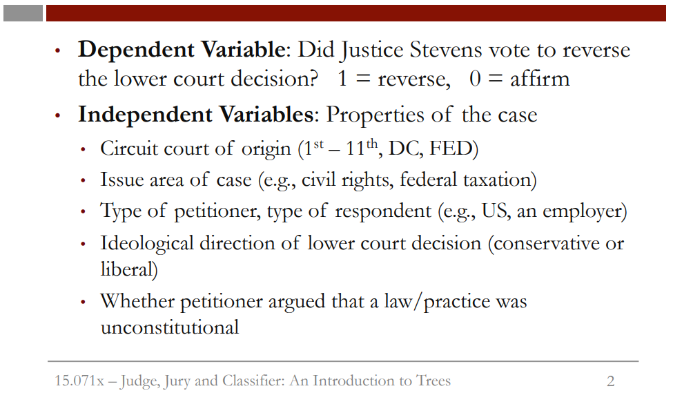  
In this problem, our dependent variable is whether or not Justice Stevens voted to reverse the lower court decision. This is a binary variable taking value 1 if Justice Stevens decided to reverse or overturn the lower court decision, and taking value 0 if Justice Stevens voted to affirm or maintain the lower court decision. Our independent variables are six different properties of the case.  
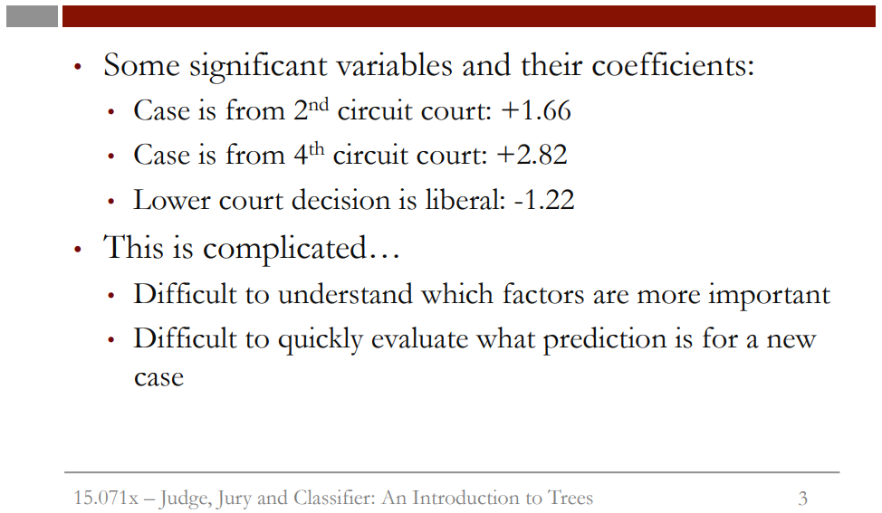
  
Now that we have our data and variables, we are ready to predict the decisions of Justice Stevens. We can use logistic regression, and we get a model where some of the most significant variables are: whether or not the case is from the 2nd circuit court, with a coefficient of 1.66;
whether or not the case is from the 4th circuit court, with a coefficient of 2.82; and whether or not the lower court decision was liberal, with a coefficient of negative 1.22.  
  
While this tells us that the case being from the 2nd or 4th circuit courts is predictive of Justice Stevens reversing the case, and the lower court decision being liberal is predictive of Justice Stevens affirming the case, it's difficult to understand which factors are more important due to things like the scales of the variables, and the possibility of multicollinearity. It's also difficult to quickly evaluate
what the prediction would be for a new case.  

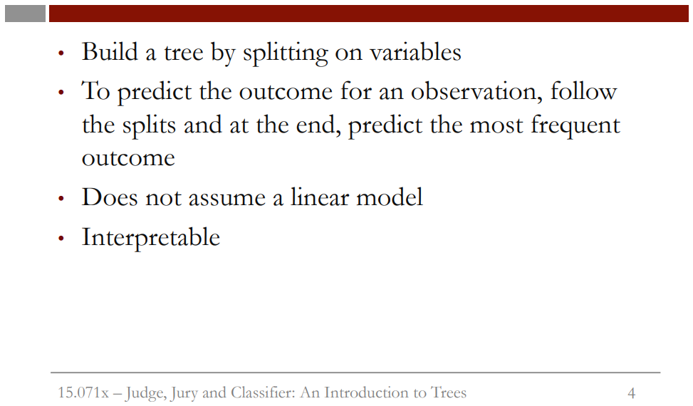
  
So instead of logistic regression, Martin and his colleagues used a method called classification and regression trees, or **CART**. This method builds what is called a tree by splitting on the values of the independent variables. To predict the outcome for a new observation or case, you can follow the splits in the tree and at the end, you predict the most frequent outcome in the training set that followed the same path.  
Some advantages of CART are that it does not assume a linear model, like logistic regression or linear regression, and it's a very interpretable model.
  
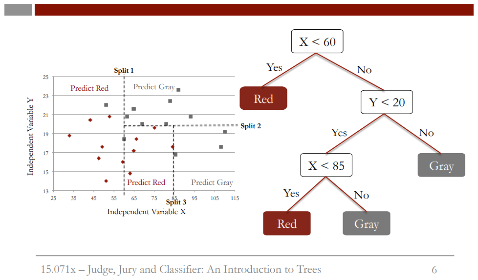
  
Let's look at an example. This plot shows sample data for two independent variables, x and y, and each data point is colored by the outcome variable, red or gray. CART tries to split this data into subsets so that each subset is as pure or homogeneous as possible. The first three splits that CART would create are shown here. Then the standard prediction made by a CART model is just the majority in each subset.
If a new observation fell into one of these two subsets, then we would predict red, since the majority of the observations in those subsets are red. However, if a new observation fell into one of these two subsets, we would predict gray, since the majority of the observations
in those two subsets are gray.  
  
A CART model is represented by what we call a tree. The tree for the splits we just generated is shown on the right. The first split tests whether the variable x is less than 60. If yes, the model says to predict red, and if no, the model moves on to the next split. Then, the second split checks whether or not the variable y is less than 20. If no, the model says to predict gray, but if yes, the model moves on to the next split. The third split checks whether or not the variable x is less than 85. If yes, then the model says to predict red, and if no,
the model says to predict gray.  
  
There are a couple things to keep in mind when reading trees. In this tree, and for the trees we'll generate in R, a yes response is always to the left and a no response is always to the right. Also, make sure you always start at the top of the tree. The x less than 85 split only counts for observations for which x is greater than 60 and y is less than 20. In the next video, we'll discuss how CART decides how many splits to generate and how the final predictions are made.  
  
## Як дерево вибирає по якій саме фічі відбувається розбиття? 
  
**Entropy** (ентропія) Это интуитивно базируется на понятию прироста информации, основанного на энтропии.
  
$$S = - \sum_{i = 1}^N {p _i log _2 p _i}$$
  
Прирост информации (information gain, IG) при разбиении выборки по признаку:
$$IG(Q)  = S_0 - \sum_{i = 1}^q {N _i \over N} S _i$$
  
В основе популярных алгоритмов построения дерева решений, таких как ID3 и C4.5, лежит принцип жадной максимизации прироста информации – на каждом шаге выбирается тот признак, при разделении по которому прирост информации оказывается наибольшим.

**Gini impurity** (невизначеність Джині)  
  
$$G = 1 - \sum_{k} {(p _k)^2}$$
  
Максимизацию этого критерия можно интерпретировать как максимизацию числа пар объектов одного класса, оказавшихся в одном поддереве.
    
[**Приклад дерева**](https://habrahabr.ru/company/ods/blog/322534/#kak-stroitsya-derevo-resheniy)  
  
## Regression Tree (quantitive features)  
  
Допустим, в выборке имеется количественный признак "Возраст", имеющий много уникальных значений. Дерево решений будет искать лучшее (по критерию типа прироста информации) разбиение выборки, проверяя бинарные признаки типа "Возраст < 17", "Возраст < 22.87" и т.д. Но что если таких "нарезаний" возраста слишком много? А что если есть еще количественный признак "Зарплата", и зарплату тоже можно "нарезать" большим числом способов? Получается слишком много бинарных признаков для выбора лучшего на каждом шаге построения дерева. Для решения этой проблемы применяют эвристики для ограничения числа порогов, с которыми мы сравниваем количественный признак [...](https://habrahabr.ru/company/ods/blog/322534/#kak-derevo-resheniy-rabotaet-s-kolichestvennymi-priznakami)  
  
Самая простая эвристика для обработки количественных признаков в дереве решений: количественный признак сортируется по возрастанию, и в дереве проверяются только те пороги, при которых целевой признак меняет значение. 

## What are tree's parameters?  
  
В принципе дерево решений можно построить до такой глубины, чтоб в каждом листе был ровно один объект. Но на практике это не делается (если строится только одно дерево) из-за того, что такое дерево будет переобученным – оно слишком настроится на обучающую выборку и будет плохо работать на прогноз на новых данных. Где-то внизу дерева, на большой глубине будут появляться разбиения по менее важным признакам (например, приехал ли клиент из Саратова или Костромы). Если утрировать, может оказаться так, что из всех 4 клиентов, пришедших в банк за кредитом в зеленых штанах, никто не вернул кредит. Но мы не хотим, чтобы наша модель классификации порождала такие специфичные правила [...](https://habrahabr.ru/company/ods/blog/322534/#osnovnye-parametry-dereva)  
  
**Когда деревья строятся до максимальной глубины:** **Randome Forest** (композиция многих деревьев) усредняет ответы деревьев, построенных до максимальной глубины.  
  
Основной способ борьбы с переобучением в случае деревьев решений: искусственное ограничение глубины или минимального числа объектов в листе.  
  
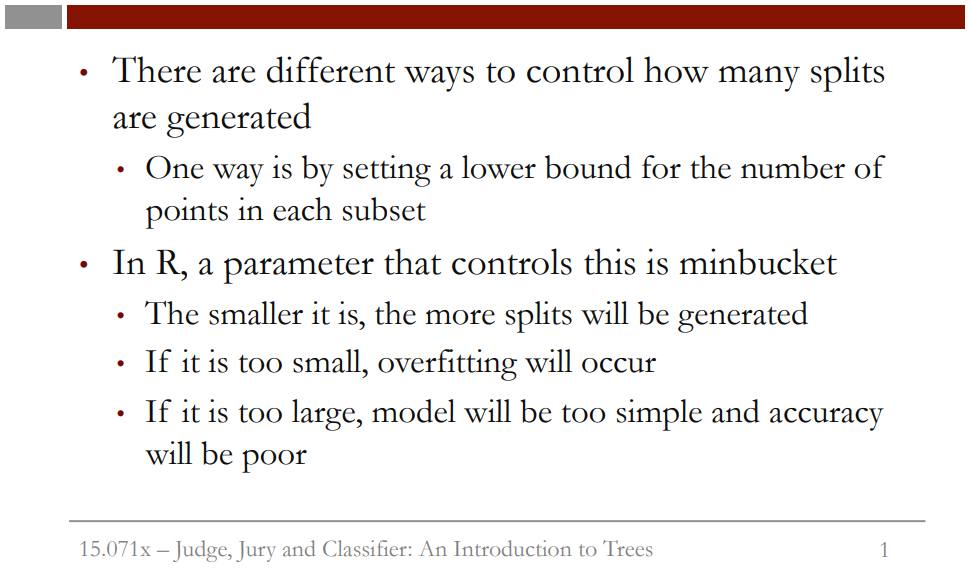
  
Параметры деревьев:

* максимальная глубина дерева;

* максимальное число признаков, по которым ищется лучшее разбиение в дереве;

* минимальное число объектов в листе.  (minbucket in R)
  
Параметры дерева надо настраивать в зависимости от входных данных, и делается это обычно с помощью **cross-validation**.
  
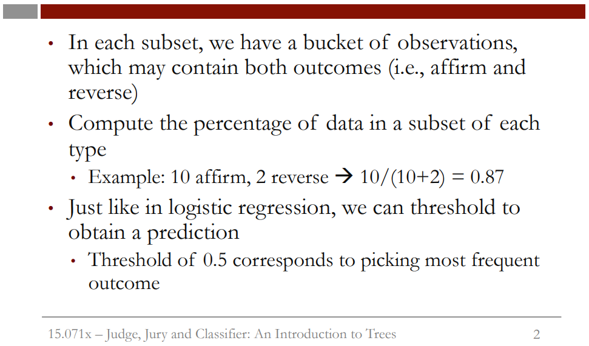
  
In each subset of a CART tree, we have a bucket of observations, which may contain both possible outcomes. In the small example we showed in the previous video, we have classified each subset as either red or gray depending on the majority in that subset. In the Supreme Court case, we'll be classifying observations as either affirm or reverse. Instead of just taking the majority outcome to be the prediction, we can compute the percentage of data in a subset of each type of outcome. As an example, if we have a subset with 10 affirms and two reverses, then 87% of the data is affirm. Then, just like in logistic regression, we can use a threshold value to obtain our prediction. For this example, we would predict affirm with a threshold of 0.5 since the majority is affirm. But if we increase that threshold to 0.9, we would predict reverse for this example.  
  
## Important notes about threshold when split buckets   
  
*QQ:* Suppose you have a subset of 20 observations, where 14 have outcome A and 6 have outcome B. What proportion of observations have outcome A?  
*A:* 0.7.  
  
*QQ:* If we set the threshold to 0.25 when computing predictions of outcome A, will we predict A or B for these observations?  
*A:* A.  
  
*QQ:* If we set the threshold to 0.5 when computing predictions of outcome A, will we predict A or B for these observations?   
*A:* A.  
  
*QQ:* If we set the threshold to 0.75 when computing predictions of outcome A, will we predict A or B for these observations?  
  
*A:* B.  
  
*Explanation.* Since 70% of these observations have outcome A, we will predict A if the threshold is below 0.7, and we will predict B if the threshold is above 0.7.  
  
# Randome Forests  
  
## **Bagging (Bootstrap aggregation)**  
  
Bagging основан на статистическом методе **bootstrap**, который позволяет оценивать многие статистики сложных распределений.  

> Метод бутстрэпа заключается в следующем. Пусть имеется выборка  размера. Равномерно возьмем из выборки  объектов с возвращением. Это означает, что мы будем  раз выбирать произвольный объект выборки (считаем, что каждый объект «достается» с одинаковой вероятностью ), причем каждый раз мы выбираем из всех исходных  объектов. Можно представить себе мешок, из которого достают шарики: выбранный на каком-то шаге шарик возвращается обратно в мешок, и следующий выбор опять делается равновероятно из того же числа шариков. Отметим, что из-за возвращения среди них окажутся повторы. Обозначим новую выборку через . Повторяя процедуру  раз, сгенерируем  подвыборок . Теперь мы имеем достаточно большое число выборок и можем оценивать различные статистики исходного распределения.  
  
Бэггинг позволяет снизить дисперсию (variance) обучаемого классификатора.  
  
Эффективность бэггинга достигается благодаря тому, что базовые алгоритмы, обученные по различным подвыборкам, получаются достаточно различными, и их ошибки взаимно компенсируются при голосовании.  
  
Бэггинг эффективен на малых выборках.  
  
## Out-of-bag error  
  
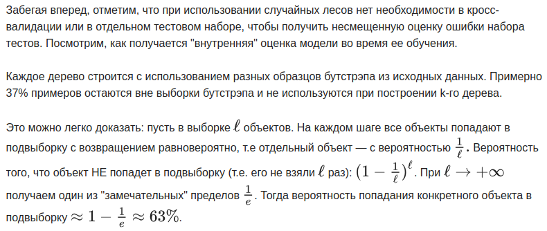
  
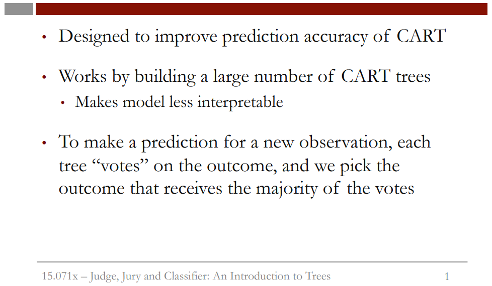
  
This method was designed to improve the prediction accuracy of CART and works by building a large number of CART trees. Unfortunately, this makes the method less interpretable than CART, so often you need to decide if you value the interpretability or the increase in accuracy more. To make a prediction for a new observation, each tree in the forest votes on the outcome and we pick the outcome that receives the majority of the votes.
  
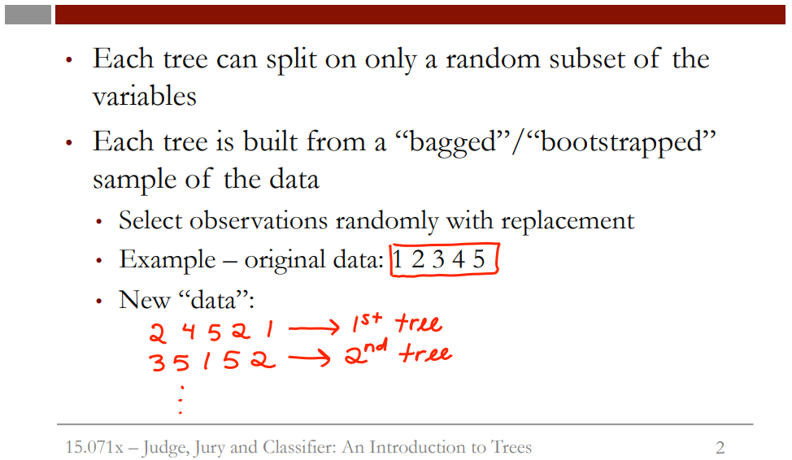
  
So how does random forests build many CART trees? We can't just run CART multiple times because it would create the same tree every time.
To prevent this, random forests only allows each tree to split on a random subset of the available independent variables, and each tree is built from what we call a **bagged** or **bootstrapped** sample of the data. This just means that the data used as the training data for each treeis selected randomly with replacement.  
  
Let's look at an example. Suppose we have five data points in our training set. We'll call them 1, 2, 3, 4, and 5. For the first tree, we'll randomly pick five data points randomly sampled with replacement. So the data could be 2, 4, 5, 2, and 1. Each time we pick one of the five data points regardless of whether or not it's been selected already. These would be the five data points we would use when constructing the first CART tree. Then we repeat this process for the second tree. This time the data set might be 3, 5, 1, 5, and 2. And we would use this data when building the second CART tree. Then we would repeat this process for each additional tree we want to create. So since each tree sees a different set of variables and a different set of data, we get what's called a forest of many different trees.  
  
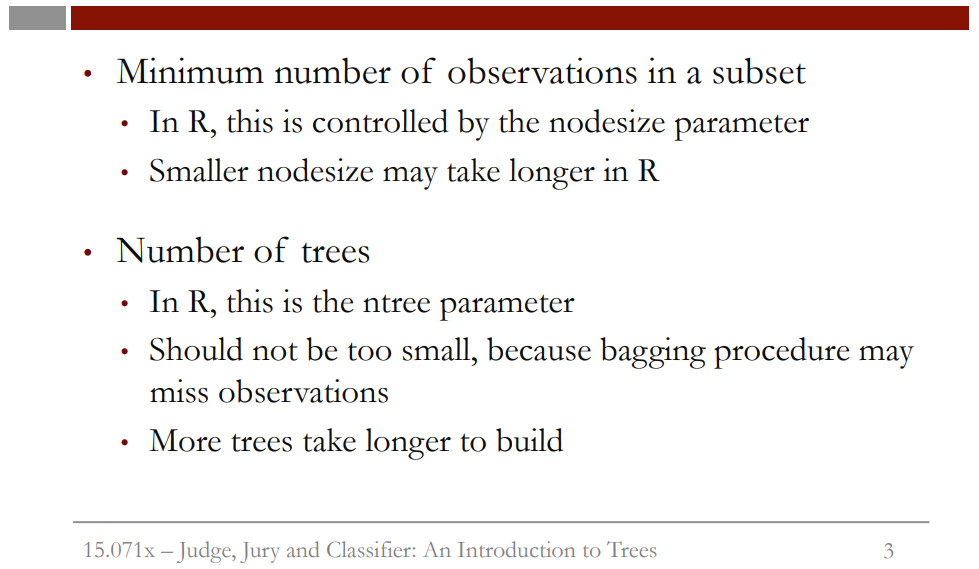

Just like CART, random forests has some parameter values that need to be selected.  
  
The first is the minimum number of observations in a subset, or the minbucket parameter from CART. When we create a random forest in R, this will be called **nodesize**. A smaller value of nodesize, which leads to bigger trees, may take longer in R. Random forests is much more computationally intensive than CART.  
  
The second parameter is the number of trees to build, which is called **ntree** in R. This should not be set too small, but the larger it is the longer it will take. A couple hundred trees is typically plenty. A nice thing about random forests is that it's not as sensitive to the parameter values as CART is.  
  
# K-fold Cross-Validation  
  
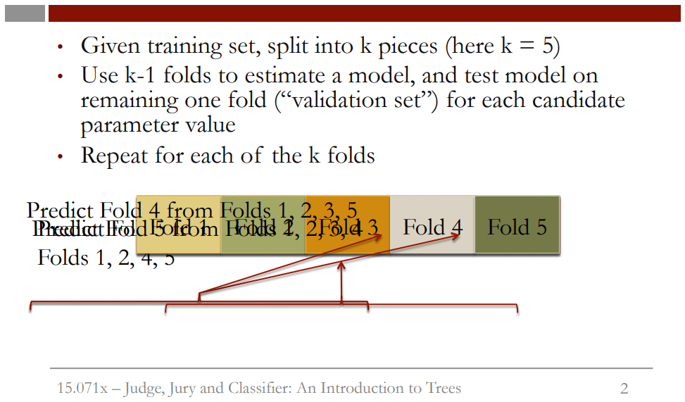
  
We'll use a method called K-fold Cross Validation, which is one way to properly select the parameter value. This method works by going through the following steps. First, we split the training set into k equally sized subsets, or folds. In this example, k equals 5. Then we select k - 1, or four folds, to estimate the model, and compute predictions on the remaining one fold, which is often referred to as the validation set. We build a model and make predictions for each possible parameter value we're considering. Then we repeat this for each of the other folds, or pieces of our training set. So we would build a model using folds 1, 2, 3, and 5 to make predictions on fold 4, and then we would build a model using folds 1, 2, 4, and 5 to make predictions on fold 3, etc. So ultimately, cross validation builds many models, one for each fold and possible parameter value.  
  
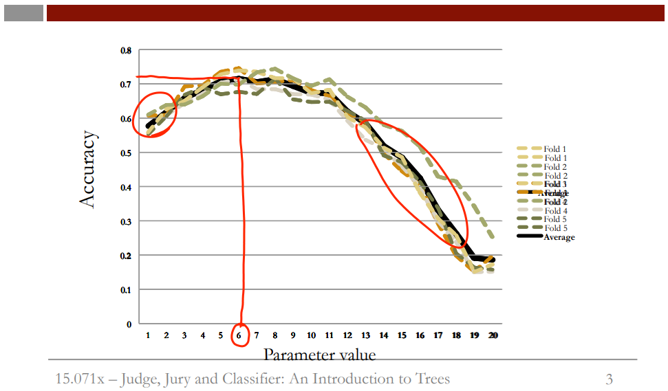
  
Then, for each candidate parameter value, and for each fold, we can compute the accuracy of the model. This plot shows the possible parameter values on the x-axis, and the accuracy of the model on the y-axis. This line shows the accuracy of our model on fold 1. We can also compute the accuracy of the model using each of the other folds as the validation sets. We then average the accuracy over the k folds to determine the final parameter value that we want to use.  
Typically, the behavior looks like this -- if the parameter value is too small, then the accuracy is lower, because the model is probably
over-fit to the training set. But if the parameter value is too large, then the accuracy is also lower, because the model is too simple.
In this case, we would pick a parameter value around six, because it leads to the maximum average accuracy over all parameter values.  
  
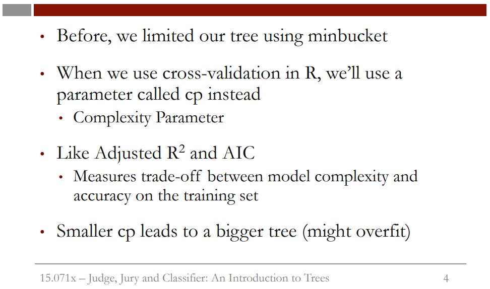
  
So far, we've used the parameter minbucket to limit our tree in R. When we use cross validation in R, we'll use a parameter called cp instead. This is the complexity parameter. It's like Adjusted R-squared for linear regression, and AIC for logistic regression, in that it measures the trade-off between model complexity and accuracy on the training set. A smaller cp value leads to a bigger tree, so a smaller cp value might over-fit the model to the training set. But a cp value that's too large might build a model that's too simple.  
  
# CP: Complexity parameter  
  
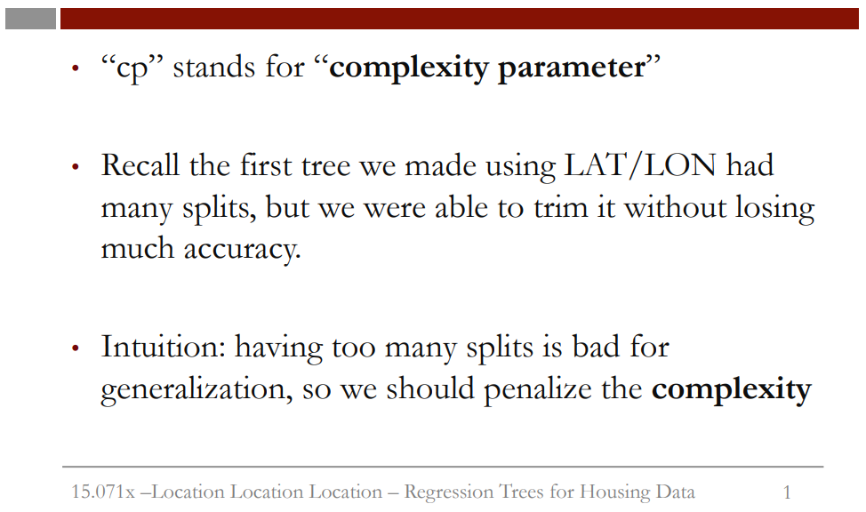
  
Recall that the first tree we made using latitude and longitude only had many splits, but we were able to trim it without losing much accuracy.
The intuition we gain is, having too many splits is bad for generalization-- that is, performance on the test set - so we should penalize the complexity.  
  
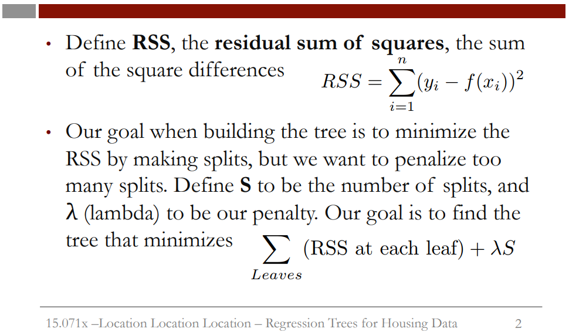
  

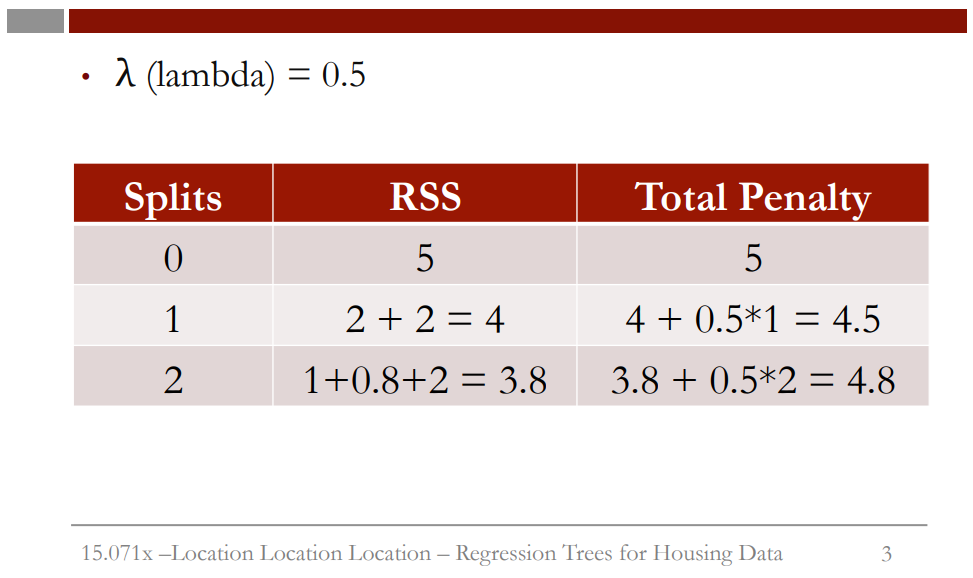
  

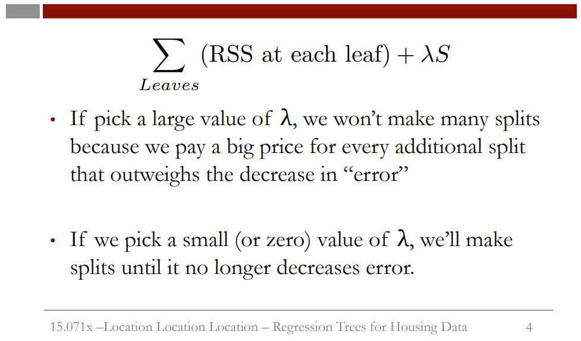
    
  
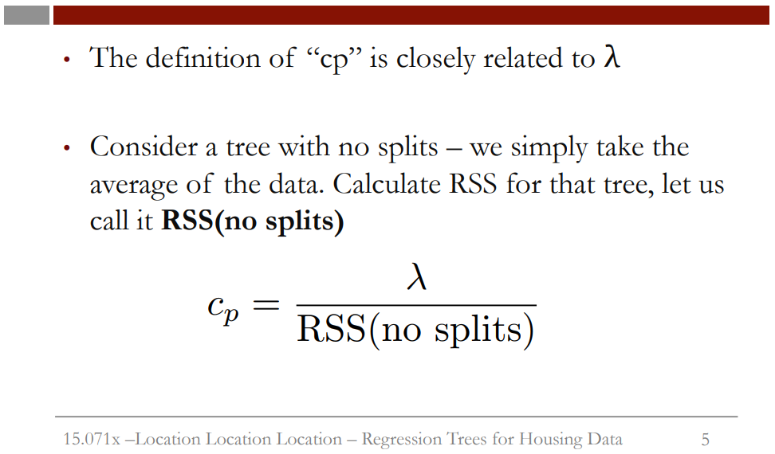
  
When you're actually using cp in your R code, you don't need to think exactly what it means - just that small numbers of cp encourage large trees, and large values of cp encourage small trees.

## Optimal trees  
  
As we saw earlier, the CART model shows variable by variable why the predictions are made. More broadly speaking, CART belongs to a class of models often described as interpretable, white box, transparent, in that they provide insights in understanding the logic for decision making.
In contrast, the random forest model, belonging to a class called black box models, also makes predictions, but the inner workings of how input translates to predictions is overly complex or unclear. In this case, the predictions are averaged across hundreds of models, making interpreting the meaning of variables and the models difficult.  

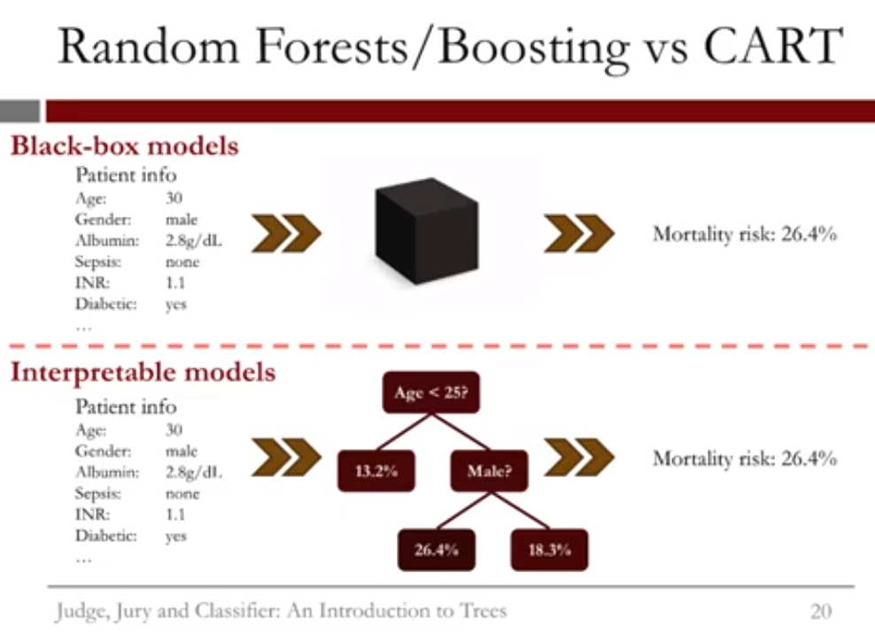
In practice, black box models often achieve higher accuracy, as we saw it in the Supreme Court example. But it comes at a cost of the low interpretability. So you might ask, is there a method that achieves both? Recent research from MIT's operations research center provides a promising solution, *Optimal Classification Trees*. Here is how it works.  
  
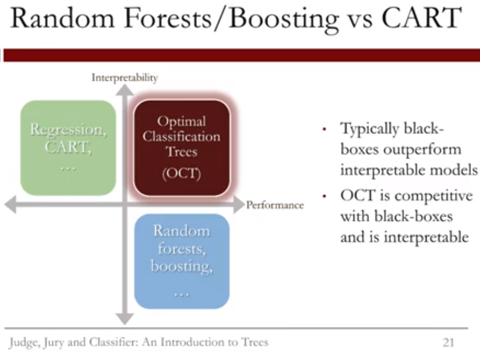

CART only learns the splits one step at a time in a greedy fashion, often resulting trees far from optimal. Instead, the researchers use modern optimization technique to train the entire tree in one step, achieving holistic optimality.  

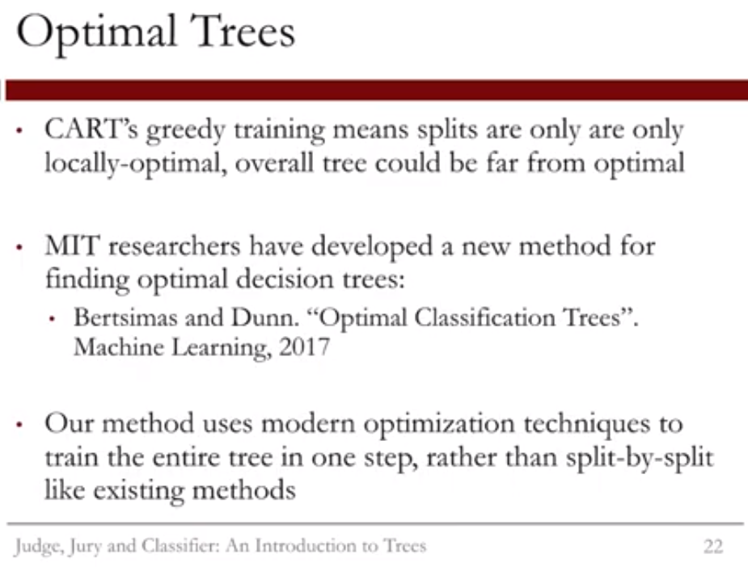

In fact, because of the flexibility that the optimization framework provides, it comes in multiple flavors. Here is an example. Like CART, optimal trees can train parallel splits, meaning that it splits one variable at a time. But more interestingly, optimal trees can uniquely train a tree with hyperplane splits, as you see in a diagram here, where multiple thereabouts can be used at a single split level. This adds more modeling flexibility and power. 

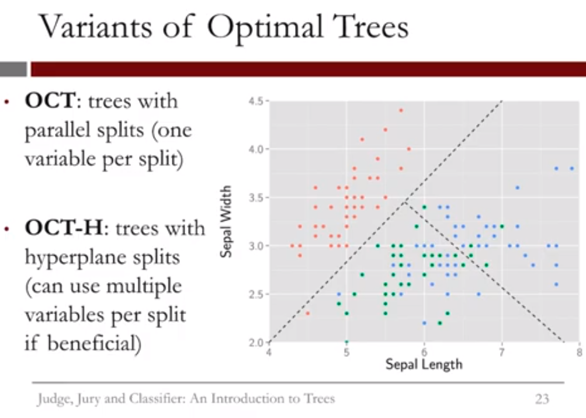

In a large scale computational experiment with 60 real world data sets, the researchers have shown that OCT and OCT with hyperplanes, shown in blue and green in this plot here, significantly outperform CART in red in terms of out of simple accuracy, even compared against the state of the art black box models such as random forest and XG boost purple and orange. OCT with hyperplanes is still highly competitive. It is also computationally fast, at a speed of about the same order of magnitude as running random forest models.  

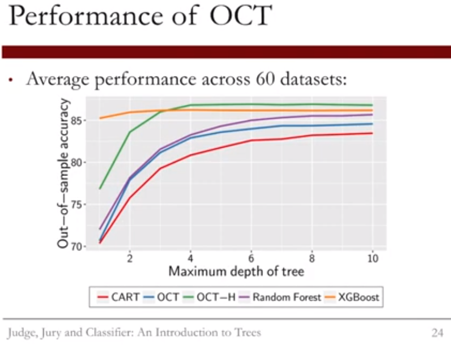

From our experience with real data science cases, being able to understand trust, and explaining a machine learning model, is a highly valuable, if not the most important aspect of a high impact analytics engagement. The development of optimal trees free the machine learning practitioners from having to choose between interpretability and performance. To learn more about optimal trees, check out the paper referenced in the slides.  
  
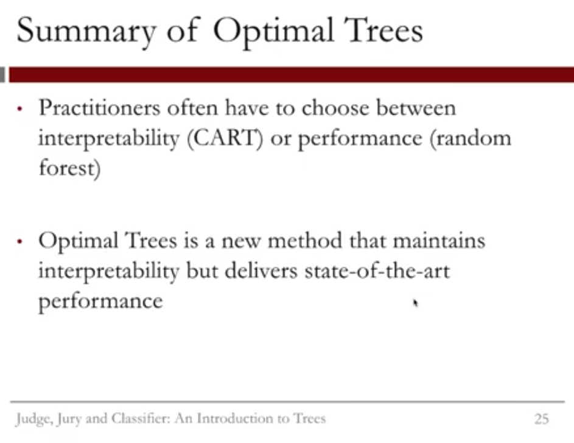

# Questions:  
  
## 1) About random forest
  
  
## 2) About 
  


## Random forest  

