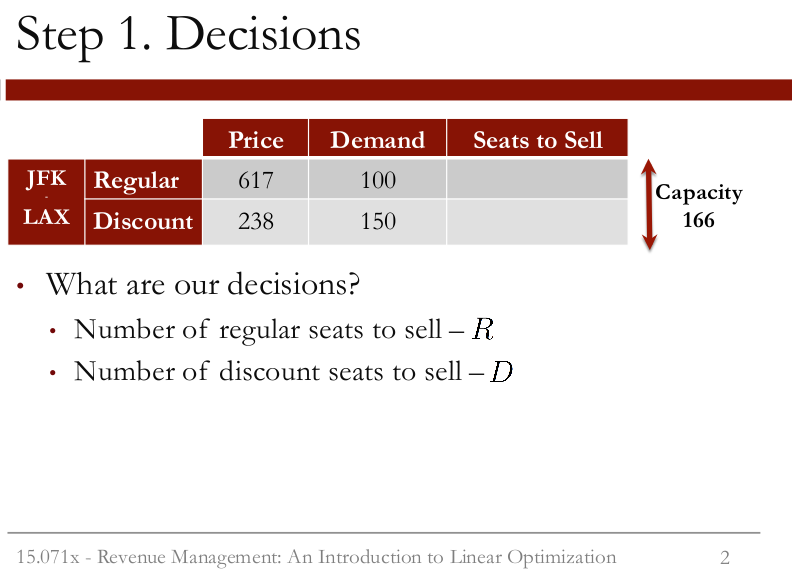

```{r setup, include=FALSE}
knitr::opts_chunk$set(echo = TRUE)
```

# QQ  

Suppose that, as in the previous video, regular seats cost \$617 and discount seats cost \$238. We are selling 166 seats. The demand for regular seats is 150 and the demand for discount seats is 150.  

*Q1: How many discount seats should we sell?*  
*A:* 16.  
*Explanation.* Since regular seats give us more revenue, we should sell enough regular seats to meet the demand. This means that we will sell 150 regular seats. Since our capacity is 166, this leaves 16 seats to sell to discount customers.  
  
*Q2: What would our total revenue be, for both regular and discount seats, assuming that we have a full plane?*  
*A:* 96358.  
*Explanation.* We would sell 150 seats to regular customers, giving us a revenue of \$617\*150, and 16 seats to discount customers, giving us a revenue of \$238\*16. Our total revenue would be \$617\*150 + \$238\*16 = $96,358.  

# Video 3: The Problem Formulation  


  
For a single route example, our problem is to find the optimal number of discount seats and regular seats to sell to maximize revenue. We'll assume that the price of regular seats is \$617, and the price of discount seats is \$238. Also, let's assume that we forecasted the demand of regular seats to be 100, and the demand of discount seats to be 150. The capacity of our airplane is 166 seats. Let's go ahead and formulate this mathematically as a linear optimization problem.   


  
The first step is to decide what our decisions are, or the variables in our model. We need to decide how many regular seats we went to sell.
We'll call the number of regular seats we sell R. We also need to decide the number of discount seats we want to sell. We'll call the number of discount seats we sell D. 


  
The second step is to decide what our objective, or our goal, is. In this case, it's to maximize the total revenue to the airline. The revenue from each type of seat is equal to the number of that type of seat sold times the seat price. In the case of regular seats, this
is \$617 times R, the number of regular seats we sell. And for discount seats, this is \$230 times D, the number of discount seats we sell.
We sum these together to get the total revenue, and our objective is to maximize this sum.  


  
The third step is to define the constraints, or limits, of our decisions. One constraint is that American Airlines can't sell more seats
than the aircraft capacity, which is 166 seats. So the total number of seats sold, R + D has to be less than or equal to the capacity of 166. Additionally, American Airlines shouldn't sell more seats than the demand for each type of seat. So the regular seats, R, shouldn't exceed 100. So R should be less than or equal to 100. And the discount seats, D, can't exceed 150. So D should be less than or equal to 150.  
  

  
The final step is to make sure our variables are taking reasonable values. In this case, it wouldn't make sense to sell a negative number of seats, so we need to make sure that both R and D are greater than or equal to 0.  


  
So our entire problem is to maximize total airline revenue, subject to the constraints that seats sold can't exceed capacity, seats sold can't exceed demand, and the seats sold can't be negative.  
  

  
Mathematically, this can be written as maximize 617\*R + 238\*D, the total revenue, subject to the constraints: R + D is less than or equal to 166, the capacity constraint; R less than or equal to 100, and D less than or equal to 150, which are the demand constraints; and R and D are both greater than or equal to 0. This is called a linear optimization problem. In the next video, we'll see how to solve this problem using the software, LibreOffice.  
  
# QQ  

In the previous video, we set up an optimization problem with 2 different types of tickets.  

*Q3: How many decision variables would we have if there were 4 different types of tickets?*
*A:* 4.  
  
*Q4: How many constraints would we have if there were 4 different types of tickets (with two different types of tickets, our model has 5 constraints: one capacity constraint, two demand constraints, and two non-negativity constraints)?*  
*A:* 5.  
  
*Explanation.* If our model had 4 different types of tickets, we would have four decision variables, one for each type of ticket. We would have 9 constraints, since we would need one capacity constraint, 4 demand constraints, and 4 non-negativity constraints.  
  
# Video 4: Solving the Problem  

In this video, we'll be solving our optimization problem using the spreadsheet AirlineRM. If you are using LibreOffice or OpenOffice, please download and open the spreadsheet AirlineRM.ods to follow along with the lecture. If you are using Microsoft Excel, please download and open the spreadsheet AirlineRM.xlsx to follow along with the lecture. The following spreadsheets have the completed model as it is at the end of the video: AirlineRM_Complete.ods and AirlineRM_Complete.xlsx.  
  
## Quick Question

In the previous video, we solved our optimization problem in LibreOffice. In your spreadsheet, change the demand for regular seats to 50 (cell D5). Then re-solve the model.  

*Q5: What is the new optimal objective value?*
*A:* 58458.  

*Q6: Now change the demand of regular seats to 200. What is the new optimal objective value?*  
*A6: 102422.

# Video 5: Visualizing the Problem  
  

  
So we saw in the previous video how we can solve linear optimization problems in LibreOffice. Let's now try to get some intuition for what's going on by visualizing our problem. Since we only have two decisions, R and D, we can visualize our constraints in two dimensions. We'll plot D on the x-axis, and R on the y-axis.  
  
We first have non-negativity constraints, so R and D are both greater than zero. We can plot the capacity constraint, R + D less than or equal to 166, which is shown as the red line here. Our solution has to be to the left of this line according to this constraint.  


  
Now, let's add in our demand constraints. The regular seats should be less than the demand of 100, which requires the solution to be below this blue line.  


  
And the discount seats should be less than the demand of 150, which requires the solution to be to the left of this green line.  


  
Taken together, our constraints define what we call our "feasible space" or the space of all possible values that our decisions can take according to our constraints.  


  
To find the optimal solution now in our feasible space, we have to use the objective, 617\*R + 238\*D. We can plot this objective in our feasible space. So to know how many seats we should sell to achieve a certain revenue, we can see different values of this line.  
So to achieve a revenue of \$20,000, our solution has to be somewhere on this line in our feasible space. To achieve a revenue of \$40,000, our solution has to be somewhere on this line in our feasible space. And to achieve a revenue of \$60,000, our solution has to be somewhere on this line in our feasible space.   


  
Since the revenue is increasing as we move this line up and our goal is to maximize the revenue, our optimal solution will be where this line can't go any further and still be in our feasible space. So our optimal solution is at this point with a revenue of \$77,408. As we can see here, the solution is dependent on how the feasible space was defined. In the next video, we'll see what happens if our capacity and demands change.  

## QQ 

Using the visualization we created in the previous video, answer the following questions:  
  
*Q7: Suppose that our demand for regular seats remains the same (100) but our demand for discount seats goes down to 100. Will our optimal solution change?*  
*A:* No.  

*Q8: Now suppose that our demand for regular seats remains the same (100) but our demand for discount seats goes down to 50. Will our optimal solution change?*  
*A:* Yes.  

*Explanation.* In the first case, our optimal solution will not change because we are only offering 66 discount seats. So even if the demand goes down to 100, we are not meeting the demand. But in the second case, we can only offer 50 discount seats. So our airplane will not be full, and our optimal solution will change to 100 regular seats and 50 discount seats.  
  
# Video 6: Sensitivity Analysis  


  
Often, in linear optimization problems, we've estimated the data we're using in the problem, but it's subject to change. Understanding how the solution changes when the data changes is called sensitivity analysis. One way that the data could change is through marketing decisions.
Suppose that American Airlines' management is trying to figure out whether or not it would be beneficial to invest in marketing its fares. They forecast that the marketing effort is likely to attract one more unit of demand, of each type, for every \$200 spent. So for the discount fare, the marketing cost per unit is \$200, and for the regular fare, the marketing cost per unit is also \$200. We want to know how much this will increase our marginal revenue for each type of fare.  


  
This graph shows our current feasible space and optimal solution. What would happen if we increased the marketing for discount fares? The demand for discount fares would increase. But since we're not even meeting the current demand for discount fares with the optimal solution, this doesn't give us any extra revenue. So we shouldn't add any marketing for discount fares. Actually, American Airlines could decrease their budget to market discount fares, and even if the demand decreases, it wouldn't change our revenue. The demand could go all the way down to 66 without affecting our decisions. In sensitivity analysis like this, we're often concerned with the shadow price of a constraint. For a discount demand constraint, this is the marginal revenue gained by increasing the demand by one unit. In this case, the shadow price is 0 for demand greater than or equal to 66.  


  
Now, let's look at what happens when we market regular fares. If we increase the demand for regular fares, our revenue increases. If we increase by 25 units of demand, our revenue increases to \$86,883. If we increase by another 25 units of demand, our revenue increases to \$96,358. So what's the shadow price in this case? Remember that the shadow price is the marginal revenue for a unit increase in demand, in this case, of regular seats. From 100 to 125, the revenue increased by \$86,883 minus \$77,408, which is equal to \$9,475. Since this was an increase of 25 units of demand, the shadow price is 9,475 divided by 25, which equals 379. We can calculate that this is the same shadow price from 125 to 150.  
So the marginal revenue for every extra unit of regular demand from 100 to 166 is $379.   


  
So given this analysis, how can we help the marketing department make their decisions? The forecast was an extra unit of demand for every \$200 spent. For discount fares, this isn't worth it, since the shadow price, or marginal revenue, is 0. But for the regular fares, this is worth it,
since the shadow price is \$379. So the marketing department should invest in marketing regular fares to increase the demand by 66 units.  


  
Another sensitivity analysis question in our problem is whether or not it would be beneficial to allocate a bigger aircraft for this flight.
This would change the capacity constraint, which currently limits the capacity to 166. With our current aircraft, the management knows that the cost per hour is \$12,067. So the total cost of the six-hour flight is \$72,402. With the 166 seats filled, we get a revenue of \$77,408 from our optimal solution. If we increase the capacity of the aircraft to 176 seats, the total cost would increase to \$76,590. But how much would this increase our revenue? And if we increase the capacity of the aircraft to \$218, the total cost would increase to \$87,342. But how much would this increase our revenue?   


  
For our analysis, let's assume that the demand does not change. If we increase our capacity to 176, the capacity constraint will move right. And our optimal solution will move right too. We now get a revenue of \$79,788. If we then increase the capacity to 218 seats, the capacity constraint will move right again, and our revenue will increase to \$89,784.  


  
So let's look at our extra profit from increasing the capacity to see if it's worth it. With our current costs and revenue, the profit is \$5,006. If we increase the capacity to 176 seats, our profit actually decreases to \$3,198. And if we increase the capacity to 218 seats, our profit decreases even more to $2,442. So even though our revenue is increasing, the cost increases too. So it's not profitable for us to increase the capacity of our aircraft.  

## QQ  
 
In your spreadsheet, change the capacity to 250 in the capacity constraint, the regular demand to 150, and the discount demand to 150. Then re-solve the model.  

*Q9: What is the objective value of the optimal solution?*  
*A:* 116350.
*Explanation.* You can change the values in the capacity constraint RHS (cell D11), the regular demand (cell D5), and the discount demand (cell D6) and resolve the model by selecting "Solver..." in the "Tools" menu. After it finishes solving, the objective value can be found in the blue cell (B8).  

# Video 7: Connecting Flights  

So far, we've only considered optimizing the fares for a single route. In this video, we'll change our optimization formulation to include connecting flights. Now, instead of just being able to go from JFK in New York to LAX in Los Angeles, let's suppose that the plane stops in Dallas at the Dallas Fort Worth airport. We still are just using one plane, but the passengers can now fly from New York to Dallas, Dallas to Los Angeles, or from New York to Los Angeles by just staying on the plane in Dallas.  


  
So how does our optimization problem change? We now have six types of seats that we can offer: the original two types, regular and discount from New York to LA, and four new types. We can sell both regular and discount seats from New York to Dallas, and regular and discount seats from Dallas to Los Angeles. We know the price of each type of ticket as well as the forecasted demand for each type of ticket. We also know that we have a capacity of 166 seats on our plane for each leg of the trip. There's room for 166 passengers on the plane from New York to Dallas, or the first leg of the trip. Then the passengers with a final destination of Dallas will get off the plane and the passengers flying from Dallas to LA will get on the plane. On the second leg of the trip, flying from Dallas to LA, we also have a capacity of 166 seats. So we need to remember that the passengers flying from New York to LA will take up capacity on both legs of the trip, while the other types of passengers will only take up capacity on one leg of the trip. So what are our decisions now? They're the number of regular tickets to sell for each type, and the number of discount tickets to sell for each type. So in total, we have six decisions to make.  


  
Now, let's define our objective. Like before, it's to maximize the total revenue. This is the sum of the price of the ticket times the number of seats of that type we sell, for each type of ticket.  


  
And like before, we have two types of constraints-- capacity constraints and demand constraints. For the capacity constraints, the airline
shouldn't sell more seats than the capacity of the plane, for each leg of the trip. So we need two capacity constraints here: one for the New York to Dallas leg and one for the Dallas to LA leg. Note that the New York to LA passengers have to be counted on both legs of the trip. So the first constraint accounts for all passengers that need to be on the plane when it flies from New York to Dallas, and the second constraint accounts for all passengers that need to be on the plane when it flies from Dallas to LA.  


  
We also need six demand constraints, one for each type of ticket. The number of seats sold should not exceed the forecasted demand for each type. 

  
And lastly, we can't sell a negative number of seats, so we have our non-negativity constraints to prevent the variables from being negative. Let's now go to LibreOffice and adjust our formulation to solve this bigger problem.  
  
# QQ  

In this quick question, we'll perform some sensitivity analysis on the connecting flights problem.  

Previously, we said that American Airlines could market their fares to increase demand. It costs \$200 in advertising to increase demand by one unit.  

*Q10: Is it worth it to market the discount fares from JFK to DFW?*    
  
1) Yes. American Airlines should market the discount fares from JFK to DFW to increase demand by 50.    

2) Yes. American Airlines should market the discount fares from JFK to DFW to increase demand by 10.  

3) No. American Airlines should not market the discount fares from JFK to DFW because even though the revenue increases, it does not exceed the costs.  

4) No. American Airlines should not market the discount fares from JFK to DFW because the revenue does not increase at all by increasing the demand for these tickets (correct).  

*Explanation.* You can answer this question without re-solving the model by noticing that we are not meeting the demand for discount fares from JFK to DFW at all. The demand could increase by 100, and we still would not offer more than 11 discount fares.  
Alternatively, you could change the demand for discount fares, and re-solve the model. The solution does not change, regardless of how much you increase the demand.

*Q11: Is it worth it to market the regular fares from JFK to LAX?*  

1) Yes. American Airlines should market the regular fares from JFK to LAX to increase demand by 50.  

2) Yes. American Airlines should market the regular fares from JFK to LAX to increase demand by 10.  

3) No. American Airlines should not market the regular fares from JFK to LAX because even though the revenue increases, it does not exceed the costs (correct).  

4) No. American Airlines should not market the regular fares from JFK to LAX because the revenue does not increase at all by increasing the demand for these tickets.  

*Explanation.* In the current solution, we are meeting the demand (80) for regular tickets from JFK to LAX. If we increase the demand by 1 unit (to 81) and run Solver on it, we find that we sell 1 more JFK-LAX regular ticket, but the objective function only increases by \$14, which does not exceed the cost of \$200 to obtain that unit. If we wanted to check how things look if we dramatically increase demand, (say by 50), we find out that the number of JFK-LAX regular seats we allocate caps out at 91 (11 extra seats) which only increases our objective function by \$154. Noting that \$154 is 11 * \$14, we can conclude that that our increase in revenue is consistently \$14 for every unit increase of JFK-LAX regular ticket demand up to 11, and then \$0 after that. Since the costs are \$200 per unit increase, it is clear that we are going to lose money marketing this.  
Therefore, American Airlines should not market the regular fares from JFK to LAX because even though the revenue increases, it does not exceed the costs.  
  
Note: One can alternatively derive this \$14 increase in revenue per unit increase in JFK-LAX regular demand without using Solver by noting that the sum of prices for the discount JFK-DFW and discount DFW-LAX is \$414 (\$224 + \$190), which is \$14 less thant the \$428 regular JFK-LAX. So we can save $14 each time if we replace both discount connecting flight seats with the regular JFK-LAX flight (and we have 11 opportunities to do this since we allocated 11 seats to discount JFK-DFW).  


