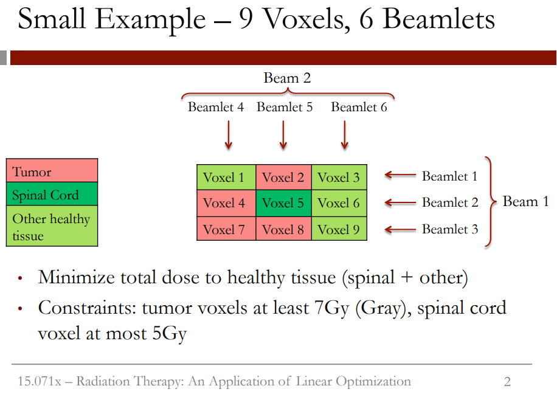
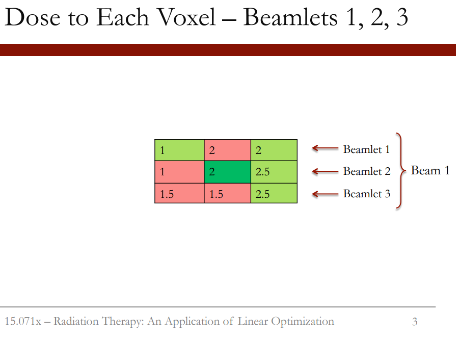
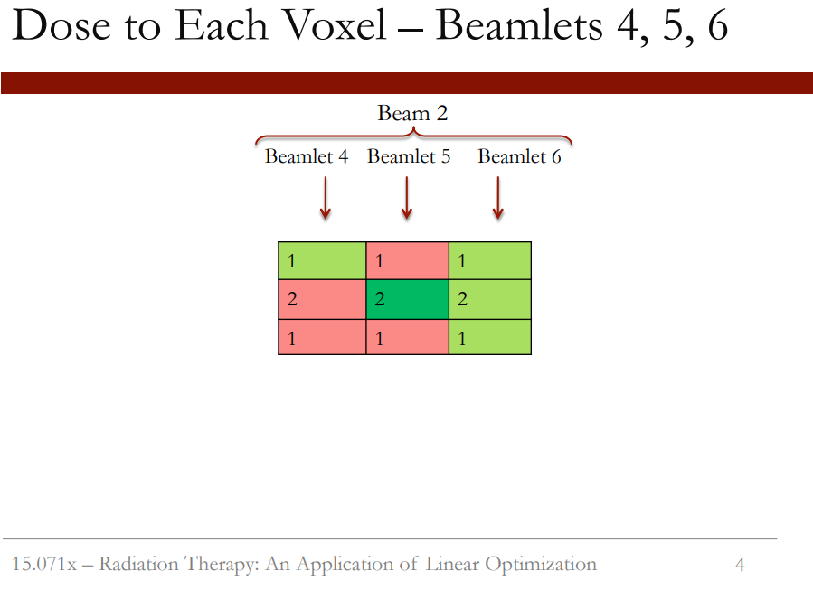
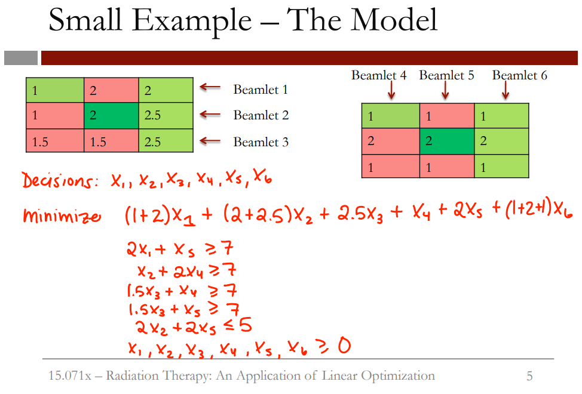
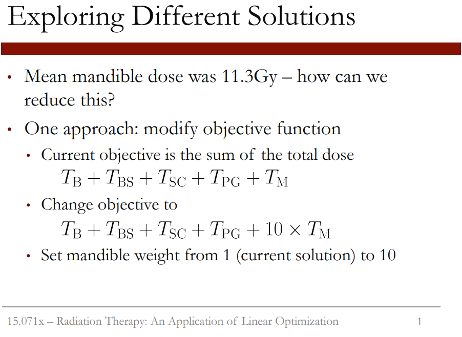
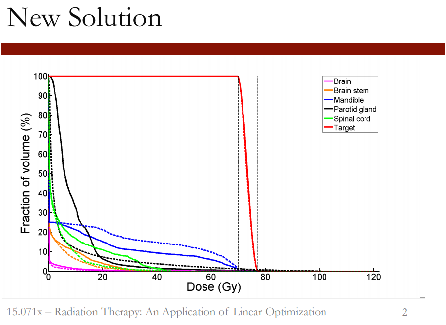
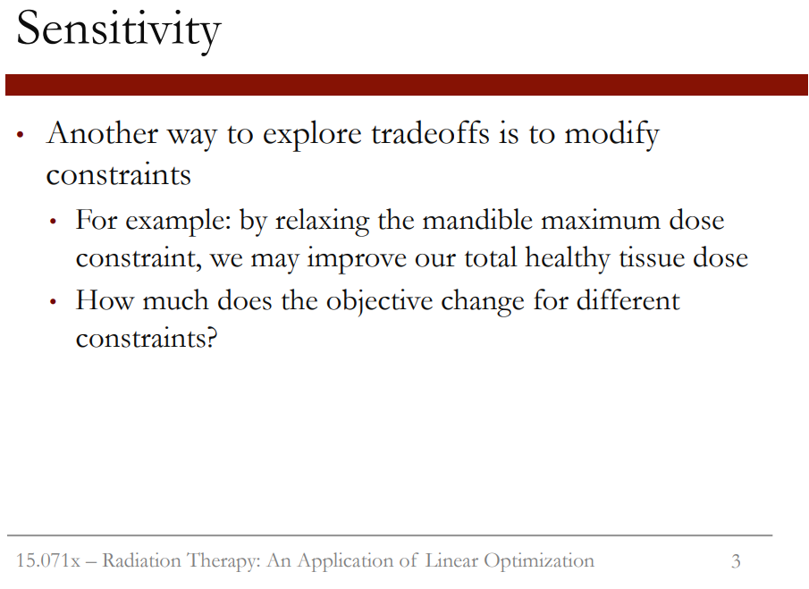
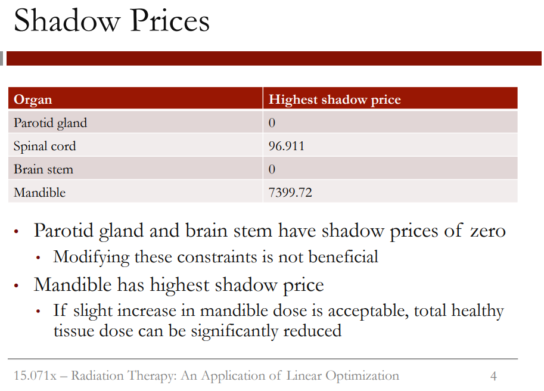

```{r setup, include=FALSE}
knitr::opts_chunk$set(echo = TRUE)
```

# Intro  

In the next video, we'll be formulating the IMRT problem as a linear optimization problem.  
*Q1: What do you think the decision variables in our problem will be?*  
  
1) The amount of radiation to deliver to the tumor  

2) The intensities of the beams  

3) The intensities of the beamlets (correct)  

4) The shape of the tumor  

*Explanation.* We get to decide the beamlet intensities - these will be the decision variables in our optimization problem. The amount of radiation to the tumor will be computed using the beamlet intensities, but we also want to make sure we know the amount of radiation to healthy tissue. The intensities of the beams would have been the decision variables in traditional radiation therapy, and the shape of the tumor is data.  
  

Suppose we have nine voxels and six beamlets. Our voxels can be categorized into three types: the tumor voxels, which are colored pink here; the spinal cord voxel, colored dark green; and other healthy tissue voxels, colored light green. So we have four tumor voxels, one spinal cord voxel, and four other healthy tissue voxels. We have two beams that are each split into three beamlets. Beam 1 is composed of beamlets 1, 2, and 3, and comes in from the right. Beam 2 is composed of beamlets 4, 5, and 6, and comes in from the top. Our objective is to minimize the total dose to healthy tissue, both to the spinal cord and to the other healthy tissue. We have two types of constraints. The first is that the dose to the tumor voxels must be at least 7 Gray, which is the unit of measure for radiation. Our second constraint is that the dose to the spinal cord voxel can't be more than 5 Gray, since we
want to be careful to protect the spinal cord.  


We know the dose that each beamlet gives to each voxel at unit intensity. This table shows the dose that each beamlet in Beam 1 gives to the voxels.
Remember that this is at unit intensity. If we double the intensity of the beamlet, we double the doses. The dose to each voxel can depend on how far the beamlet has to travel, or the type of tissue that the beamlet has to travel through.  


Similarly, we know the dose that each beamlet in Beam 2 gives to each voxel, again at unit intensity. The dose depends on the direction of the beam and what it travels through.  

  
Putting these tables together, we can write out our optimization problem. Our decision variables are the intensities of each beamlet. We'll call them x_1, the intensity for beamlet 1, x_2, the intensity for beamlet 2, x_3, the intensity for beamlet 3, etc., all the way up through x_6. As we mentioned before, our objective is to minimize the total dose to the healthy tissue, including the spinal cord. So we want to minimize the total dose beamlet 1 gives to healthy tissue, which is (1 + 2)x_1, plus the total dose beamlet 2 gives to healthy tissue, which is (2 + 2.5)x_2, plus the total dose beamlet 3 gives to healthy tissue, which is 2.5x_3. Now for beamlets 4, 5, and 6, beamlet 4 just gives one dose to healthy tissue, beamlet 5, 2x_5, and then beamlet 6, we have (1 + 2 + 1)x_6.  
  
Now for our constraints. First, we need to make sure that each voxel of the tumor gets a dose of at least 7. Let's start with the first tumor voxel in the top row. So 2x_1 + x_5 needs to be greater than or equal to 7. Now the tumor voxel in the second row, we have x_2 + 2x_4, also greater than or equal to 7. Now for the two tumor voxels in the bottom row, we have 1.5x_3 + x_4, greater than or equal to 7. And 1.5x_3 + x_5, greater than or equal to 7. Then for the spinal cord, we need to make sure that 2x_2 + 2x_5 is less than or equal to 5. And lastly, we just need to make sure that all of our decision variables are non-negative.  
  
So they should all be greater than or equal to 0. Now that we've set up our optimization problem, we'll solve it in LibreOffice in the next video.  
  
# QQ

*Q2: If the beamlet intensity of the first beamlet is set to 3, how much radiation will that beamlet deliver to tumor voxels?*
*A:* 6.
  
*Q3: How much radiation will it deliver to healthy tissue voxels?*  
*A:* 9.  

*Explanation.* Beamlet 1 hits one tumor voxel, and two healthy tissue voxels. At unit intensity, it delivers a dose of 2 to the tumor voxel, a dose of 2 to the first healthy tissue voxel, and a dose of 1 to the second healthy tissue voxel. At intensity 3, this means that it will deliver a dose of 2\*3 = 6 to the tumor voxel, and 2\*3 + 1\*3 = 9 to the healthy tissue voxels.  

# Video 5  


In the previous video, we saw that the mandible, or jawbone, received the highest dose out of all of the critical structures. The mean mandible dose was 11.3 gray. So how can we reduce this? One approach is to modify our objective function. Our current objective is to minimize the sum of the total dose to each critical structure. So we're minimizing the sum of the total dose to the brain, plus the total dose to the brain stem, plus a total dose to the spinal cord, plus the total dose to the parotid glands, plus the total dose to the mandible. We could instead change our objective to make the total dose to the mandible more important. This can be done by weighting the term for the mandible. By giving the mandible dose a weight of 10, the total dose to the mandible becomes 10 times more important in our objective than the total dose to the other critical structures.  


If we solve our problem with this new objective, we get the solution shown in this figure. The dose to the tumor, shown as the red line, does not change. It still stays within the constraints we've defined. For each of the critical structures, the solution with the previous objective is shown as a dotted line, and the new solution with the weighted objective is shown as a solid line. We can see that the dose to the mandible, shown in blue, has significantly decreased by adding a weight in the objective. However, the dose to other critical structures has increased, especially to the parotid glands, shown in black, and to the spinal cord, shown in green. This shows how you can modify the objective to capture different trade-offs that might be desirable to different decision-makers or for different patients.  

  
Another way to explore trade-offs is to modify the constraints. For example, by relaxing the mandible maximum dose constraint or by allowing the maximum dose to the mandible to be higher, we may improve our total healthy tissue dose. We would like to know how much the objective changes for different constraints.  


This can be answered by looking at the shadow prices of the constraints. Recall that we have a constraint limiting the total dose for each voxel in each critical structure. This table shows the highest shadow price for any one voxel in each critical structure. The parotid glands and the brain stem have shadow prices of 0. This means that we're not even giving the maximum amount of radiation allowed to these structures, so modifying the constraints is not beneficial. The spinal cord has a shadow price of 96.911. This means that by increasing the radiation to one voxel of the spinal cord by one unit,
we can decrease the total radiation to other critical structures by 96.9 units. The mandible has the highest shadow price of 7,399.72. So if a slight increase in the mandible dose to a single voxel is acceptable, the total healthy tissue dose can be reduced. Keep in mind that this is the total reduction across all voxels in the objective. We've seen in this video that by modifying the formulation, both the objective and the constraints, we can explore different trade-offs in our problem.  
  
