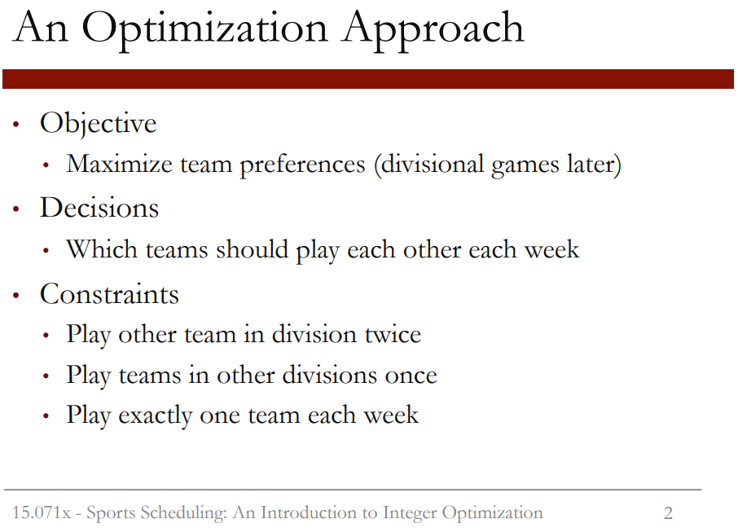

```{r setup, include=FALSE}
knitr::opts_chunk$set(echo = TRUE)
```


Let's look at how sports scheduling can be done with optimization by starting with a small example. Suppose we're trying to schedule a tournament between four teams-- Atlanta, Boston, Chicago, and Detroit. We'll call these teams A, B, C, and D. These teams are divided into two divisions. Atlanta and Boston are in one division, and Chicago and Detroit are in the second division. Each team plays one game a week for a total of four weeks. During the four weeks, each team plays the other team in the same division twice, and each team plays the teams in the other divisions once. The team with the most wins from each division will play in the championship game. For this reason, teams prefer to play divisional games later. If team A plays team C and D in the first two weeks and wins both games while team B also plays team C and D and loses both games, A knows that they only need to win one of the games against B to beat B in terms of wins and to go to the championship.  
  
  
  
We can schedule this tournament by using an optimization model. Our objective is to maximize team preferences, which are that teams would like to play divisional games later. Our decisions are which teams should play each other each week. And we have three types of constraints. Each team needs to play the other team in their division twice, each team needs to play the teams in the other division once, and each team should play exactly one team each week.  
  
  

Let's start by discussing our decision variables. We need to decide which teams will play each other each week. To do this, let's define decision variables which we'll call x_ijk. If team i plays team j in week k, then x_ijk will be equal to 1. Otherwise, x_ijk equals 0. As an example, suppose team A plays team C in week 2. Then x_AC2 would equal 1. Since A only plays C once, we should have then that x_AC1, or A playing C in week 1, should be equal to 0. Similarly, x_AC3 should equal 0, and x_AC4 should equal 0. This is called a binary decision variable since it's a decision variable that
can only take two values, 0 and 1.  
  
  
  
This is a new type of decision variable, and it's what makes integer optimization different from linear optimization. The decision variables in integer optimization can only take integer values. This includes binary decision variables, like the ones we have here, that can only be either 0 or 1. These variables can model decisions like where to build a new warehouse, whether or not to invest in a stock, or assigning nurses to shifts. Integer optimization problems can also have integer decision variables that take values 1, 2, 3, 4, 5, etc. These variables can model decisions like the number of new machines to purchase, the number of workers to assign for a shift, and the number of items to stock in a store. Other than the new types of variables, integer optimization is exactly like linear optimization. But we'll see this week how integer optimization variables, and especially binary variables, can increase our modeling capabilities.  
  
  
  
Now let's go back to our formulation. As we said before, our decisions are which teams should play each other each week.  

  
  
We'll model this with the binary decision variables we just discussed-- x_ijk which equal 1 if team i plays team j in week k. Now let's use these decision variables to form our constraints. The first constraint is that each team should play the other team in their division twice. So teams A and B should play each other twice in the four weeks.  
  

  
This can be modeled with the constraint x_AB1 + x_AB2 + x_AB3 + x_AB4 = 2. This will force two of these decision variables to be equal to 1, and the other two decision variables to be equal to 0. The ones that are equal to 1 will correspond to the weeks that A and B will play each other. We'll have a similar constraint for teams C and D. Our next constraint is that each team should play the teams in the other division once. So teams A and C should play each other once in the four weeks.  
  


This can be modeled with a constraint x_AC1 + x_AC2 + x_AC3 + x_AC4 = 1. This is very similar to the previous constraint, except this time only one of the decision variables will have value 1. We'll have similar constraints for teams A and D, teams B and C, and teams B and D. Our last type of constraint is that each team should play exactly one other team each week. This means that A should play B, C or D in week 1.  
  


Now, let's model our objective. Let's assume that teams have a preference of 1 for playing divisional games in week 1, a preference of 2 for playing divisional games in week 2, a preference of 4 for playing divisional games in week 3, and a preference of 8 for playing divisional games in week 4.
So the preference doubles with each later week. Then we can model our objective as x_AB1 + 2x_AB2 + 4x_AB3 + 8x_AB4 + x_CD1 + 2x_CD2 + 4x_CD3 + 8x_CD4.
Then if team AB plays in week 3, we'll add 4 to our objective. If they play in week 1, then we'll only add 1 to our objective. If they don't play in a week, that term will be 0 and will not contribute to the objective. Now that we've set up our problem, we're ready to solve it.  

# Adding Logical Constrains  
  


One of the most powerful properties of integer optimization is the ability to add what we call logical constraints. These use binary variables to implement different restrictions. Let's look at a few examples.  
  
Suppose we want to add the constraint that A and B can't play in both weeks 3 and 4. We can do this by adding the constraint x_AB3 + x_AB4 less than or equal to 1. What are feasible values for these two variables, given this constraint? Both variables can be 0, or one or the other can be 1. A solution with both variables equal to 1 would be infeasible. So this constraint models the restriction that teams A and B can't play in both weeks 3 and 4. Note that this only works because the variables only take values 0 or 1. Let's look at another example. Suppose we want to add the restriction that if A and B play in week 4, then they must also play in week 2. We can do this by adding the constraint x_AB2 greater than or equal to x_AB4. Let's consider feasible solutions to this constraint. If x_AB4 equals 1, then x_AB2 must also equal 1. But if x_AB4 equals 0, then x_AB2 can be equal to either 0 or 1. So this constraint exactly models the restriction we wanted. Lastly, suppose that teams C and D must play in week 1 or 2 -- they can't play both games in weeks 3 and 4. We can model this constraint with x_CD1 + x_CD2 greater than or equal to 1. Feasible solutions are both variables equal to 1,
or one variable equal to 1. Both variables can't equal 0. These are just a few examples of logical constraints that we can implement using binary variables.  
  
Let's go into LibreOffice now and add these constraints to our model.  
  
  

  